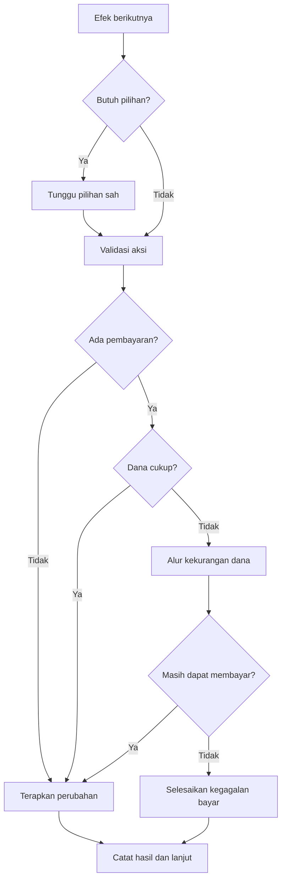
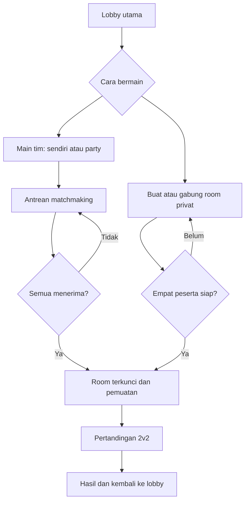

# WNI Simulator — Acuan Pengembangan Godot

Dokumentasi analisis papan dan video referensi untuk pengembangan adaptasi digital di Godot.

**Status: tahap analisis dan spesifikasi. Repositori ini belum berisi game Godot yang dapat dimainkan.** Data yang belum terbaca atau aturan yang belum terverifikasi ditandai secara eksplisit.

**Target produk terbaru:** game online dengan lobby, matchmaking, dan mode tim sesuai permintaan pengguna. Usulan awal mode tim adalah 2v2. Bagian 45–49 menjadi acuan terbaru untuk scope, tim, dan roadmap; rekomendasi MVP lokal pada bagian 36–44 kini menjadi tahap pengujian fondasi, bukan target akhir.

## Panduan membaca

- Analisis papan, harga, kartu dan aturan: bagian 1–35.
- [Jumlah anggota dan pembagian tugas](#36-rekomendasi-jumlah-anggota-tim): bagian 36–37.
- [Prioritas fitur](#38-scope-dan-urutan-prioritas-fitur) dan [roadmap](#39-roadmap-perkiraan-waktu-dan-gerbang-kelulusan): bagian 38–39.
- [Alur kerja tim](#40-alur-kerja-tim-dari-referensi-hingga-fitur-selesai), [alur permainan](#41-alur-pemain-dan-satu-giliran), dan [alur teknis](#42-alur-teknis-godot-dan-perluasan-online): bagian 40–42.
- [Pengujian dan workflow GitHub](#43-pengujian-github-dan-kriteria-selesai), serta [risiko dan keputusan awal](#44-risiko-utama-dan-keputusan-pertama-yang-perlu-dibuat): bagian 43–44.

- [Target online, lobby, matchmaking dan tim](#45-target-online-dengan-lobby-matchmaking-dan-mode-tim): bagian 45–49, menggantikan rencana online sebagai fitur opsional.

- [Saran penyempurnaan dan scope MVP](#50-saran-penyempurnaan-pengalaman-bermain-dan-prioritas-mvp): tempo, kerja sama tim, tutorial, pemain bangkrut, deck online dan rematch.

## Referensi

- Unggahan “WNI cobain WNI Simulator” (76,97 detik, 720 × 1280): `SaveInta.com_AQMkEuO1zA2rB2TPUfk1RzyhfV9q1_XLrNLZFHBsx9fH-BwDdW7SnckO4sBdjeAEKaLKl2A1w-HDGlWNjQ6pQOvZXjo6OBThw1Ga1j8(1).mp4`. Identik secara SHA-256 dengan unggahan bernama sama tanpa `(1)`; dihitung sebagai satu sumber, bukan dua bukti independen. Analisis melalui frame, teks kartu, dan subtitle, bukan transkripsi audio lengkap.

- Unggahan “WNI cobain WNI Simulator pt.2”: `SaveInta.com_AQP6AVbEItUK3Jjxqq1RCNe7Ja1rhaI4FNdt8xupr9hbO-Pqy0NOYNM3wffIv_VbHwFlspTuF1FMFYWLE-AXPusijvoypDBOHVJSmyA.mp4` (83,33 detik, 720 × 1280). Analisis berdasarkan frame, tulisan kartu, dan subtitle.

- [Video tutorial](https://www.youtube.com/watch?v=OEyiAVH1OaU)
- [Video pendek](https://www.youtube.com/shorts/IEihkCUZTwI)
- [Referensi Instagram 1](https://www.instagram.com/p/DdVhylZgdFx/)
- [Referensi Instagram 2](https://www.instagram.com/p/DdLv_dRvo1-/)
- Foto papan yang diberikan pengguna.
- Unggahan video unboxing berdurasi sekitar 3 menit yang dianalisis melalui frame dan teks yang tampil.
- Unggahan gameplay “Monopoli versi Indonesia (WNI SIMULATOR) Part 1”.
- Unggahan gameplay tambahan: `SaveInta.com_AQMHJKqzfz1-5No7M4e2kJLoCoMahKN05RkYVP_ek8p3hWgAqOY0THqoIBQ6tuUW5AstELNNgFm8F9qt5wJmq_mrpG7bksn8gmjgeN4.mp4` (84,52 detik, 720 × 1280). Dianalisis melalui frame, tulisan kartu, dan subtitle; bukan transkripsi audio lengkap.

Timestamp pada bagian 2–4 mengacu pada unggahan unboxing. Timestamp pada bagian 10–17 mengacu pada video gameplay tambahan berdurasi 84,52 detik. Timestamp pada bagian 19–27 mengacu pada video “WNI cobain WNI Simulator pt.2” berdurasi 83,33 detik. Timestamp bagian 28–35 mengacu pada video 76,97 detik tersebut. Timestamp tidak harus sama dengan versi pada tautan media sosial. Dokumen ini merangkum analisis percakapan; bukan salinan buku aturan resmi. Video, gambar, dan aset visual asli tidak disertakan.

## 1. Bentuk permainan dan papan

Permainan papan ekonomi berbasis giliran dengan pergerakan pion, pembelian properti, pembangunan, sewa, kartu Takdir dan Musibah, serta pembayaran kepada Negara.

Foto memperlihatkan lintasan berbentuk segi lima di atas papan persegi panjang. Kelompok wilayahnya mencakup Sumatera, Kalimantan, Sulawesi, Papua, dan Jawa. Tutorial menyebut 25 properti; angka ini bukan jumlah seluruh petak.

Urutan kelompok dari START yang dicatat dalam analisis:
START → Sumatera → LAPAS → Kalimantan → Pajak Tahunan → Sulawesi → Pengadilan → Papua → Parkiran Pungli → Jawa → START.

Urutan lengkap setiap petak belum dikunci. Bekasi terlihat sebagai area terpisah dari lintasan utama. Video terbaru menunjukkan Banjir Bandang mengirim pion ke Bekasi dan melewatkan satu giliran; cara kembali ke lintasan belum terverifikasi (bagian 31).

Komponen yang terlihat:
- Papan, uang permainan, sertifikat tanah, dan buku aturan.
- Dua dadu hijau.
- Pion karakter dengan dudukan.
- Kartu Takdir biru dan Musibah merah.
- Penanda bangunan dan jalan tol.

Penampilan karakter belum menjadi bukti bahwa setiap karakter memiliki kemampuan khusus.

## 2. Harga properti dan sewa

Semua nominal berikut adalah rupiah dalam permainan, bukan harga produk board game.

| Data | Padang (~02:09) | Palu (~02:13) | Jakarta (~02:22–02:23) |
| --- | ---: | ---: | ---: |
| Wilayah | Sumatera | Sulawesi | Jawa |
| Harga tanah | 1.500.000* | 2.500.000 | 4.000.000 |
| Sewa kosong | 400.000 | 700.000 | 1.200.000 |
| Sewa Subsidi 1 | 700.000 | 1.400.000 | 2.500.000 |
| Sewa Subsidi 2 | 1.200.000 | 2.500.000 | 4.000.000 |
| Sewa Rumah OKB | 2.000.000 | 3.600.000 | 5.500.000 |
| Biaya bangunan subsidi | 350.000 | 500.000 | Belum terbaca |
| Biaya bangunan OKB | 500.000 | 800.000 | 1.200.000 |

*Angka 1,5 pada harga Padang terlihat; kelanjutannya tertutup jari. Pembacaan 1,5 juta masih sementara. Beberapa bagian label nominal Padang juga tertutup sebagian.*

**Koreksi:** pembacaan lama harga Jakarta Rp6 juta dibatalkan. Sertifikat dalam video memperlihatkan Rp4 juta.

Biaya bangunan di tabel adalah nominal yang tertulis pada sertifikat. Mekanisme pembayaran ketika meningkatkan dua subsidi menjadi OKB harus diverifikasi dari aturan pembangunan. Angka tersebut tidak otomatis merupakan total biaya dari tanah kosong sampai OKB.

Dari analisis video gameplay sebelumnya, Surabaya tercatat memiliki harga tanah Rp4 juta dan sewa Rp1,2 juta / Rp2,5 juta / Rp4 juta / Rp5,5 juta. Biaya subsidi tercatat Rp750 ribu; pembacaan biaya OKB Rp1,2 juta lebih kurang jelas. Data Surabaya tidak boleh dipakai untuk mengisi otomatis biaya subsidi Jakarta.

### Implikasi ekonomi

Dengan gaji START Rp1 juta:
- Sewa Jakarta kosong setara 1,2 kali gaji.
- Sewa Jakarta OKB setara 5,5 kali gaji.
- Sewa Palu OKB setara 3,6 kali gaji.

Sewa kosong Palu adalah 28% harga tanah, sedangkan Jakarta 30%. Rasio tersebut menunjukkan bahwa tarif perlu disimpan per properti, bukan diturunkan dari satu persentase tetap.

Rasio sewa terhadap harga tanah bukan keuntungan bersih: belum memasukkan biaya pembangunan, peluang pendaratan, pajak, dan efek kartu.

## 3. Musibah: Penggeledahan KPK

Terlihat sekitar 01:58. Kartu meminta satu dadu.

| Dadu | Efek |
| --- | --- |
| 5–6 | Tidak terbukti bersalah; bayar Rp300.000 kepada Negara sebagai biaya administrasi. |
| 3–4 | Sewa seluruh Surat Tanah pemain tidak berlaku sampai giliran pemain itu tiba kembali. |
| 1–2 | Pion masuk LAPAS dan membayar Rp500.000 kepada Negara. |

Demonstrasi memperlihatkan hasil 4.

Konsekuensi implementasi:
- Penonaktifan sewa tidak memindahkan kepemilikan tanah.
- Efek berakhir ketika giliran berikutnya milik pemain terdampak datang, bukan setelah sejumlah detik.
- Jangan mengganti efek ini dengan pengalihan sewa ke Negara.
- Denda kartu Rp500.000 tidak otomatis ditambah denda petak Pengadilan.
- Perpindahan paksa ke LAPAS harus dibedakan dari pergerakan biasa.
- Urutan aksi ketika pembayaran menyebabkan kebangkrutan perlu mengikuti aturan yang terverifikasi.

## 4. Takdir: Tambang Ilegal

Terlihat sekitar 02:27–02:38. Kartu memiliki ikon jam dan meminta satu dadu.

| Kondisi / dadu | Pembacaan efek |
| --- | --- |
| Belum ada pemain memiliki Surat Tanah | Teks tampak meminta mengabaikan efek dan membuka kartu Takdir lagi; bagian kecil ini perlu konfirmasi lebih tajam. |
| 2, 4, 6 | Pilih satu Surat Tanah milik pemain lain, lalu kembalikan kepada Negara. |
| 1, 3, 5 | Surat Tanah paling mahal milik sendiri diubah menjadi jalan tol secara permanen. |

Frame bergerak dan subtitle menutup sebagian teks. Efek ganjil didukung oleh bagian kartu yang terlihat serta subtitle tentang penyitaan, konversi jalan tol, dan sifat permanen.

Konsekuensi:
- Hasil genap tidak memberi tanah lawan kepada pemain penarik kartu.
- Hasil ganjil mengubah fungsi petak, bukan sekadar pemilik.
- Penanda tol harus mengikuti perubahan logika petak.
- Jangan menambahkan kompensasi atau aturan bangunan yang tidak terbaca.

Belum terverifikasi:
- Pemain penarik kartu tidak mempunyai tanah.
- Tidak ada lawan yang mempunyai tanah.
- Ada beberapa tanah dengan harga tertinggi yang sama.
- Apakah “paling mahal” memakai harga tanah saja atau termasuk bangunan.
- Penanganan bangunan pada tanah yang dikembalikan atau dikonversi.

Hubungan ikon jam dengan penggabungan kartu setelah semua pemain menyelesaikan dua putaran berasal dari catatan tutorial sebelumnya, bukan penjelasan lengkap pada video unboxing.

## 5. Aturan lain dari analisis referensi sebelumnya

Bagian ini merupakan catatan lintas referensi. Detail pelaksanaan yang belum jelas tetap harus dikonfirmasi sebelum aturan dianggap final.

| Sistem | Catatan |
| --- | --- |
| START | Gaji Rp1 juta. |
| Pembangunan | Tutorial mengaitkan kesempatan membangun dengan menerima gaji setelah melewati START, sebelum efek tujuan; urutan detail perlu dikonfirmasi. |
| Tingkat bangunan | Kosong → Subsidi 1 → Subsidi 2 → Rumah OKB. Tutorial menyebut peningkatan OKB pada putaran berikutnya. |
| Pajak Tahunan | Tercatat Rp500 ribu per properti. |
| LAPAS | Mendarat biasa berbeda dari dikirim sebagai tahanan. Catatan tutorial menyebut sewa properti tahanan dibayar kepada Negara. |
| Keluar LAPAS | Catatan tutorial menyebut dadu kembar, pembayaran Rp1,5 juta, atau keluar otomatis pada giliran ketiga; urutan waktunya belum jelas. |
| Pengadilan | Satu dadu: 5–6 kompensasi Rp1 juta; 3–4 LAPAS dan denda Rp1,5 juta; 1–2 LAPAS dan pembayaran 50% uang kepada Negara. |
| Pembulatan Pengadilan | Tulisan “bulatkan ke atas” terlihat sekitar 01:22; satuan pembulatan belum diketahui. |
| Tol | Tercatat pembayaran Rp500 ribu dan perpindahan; perjalanan tol tidak memberi gaji START. Tujuan dan pemicunya perlu dirinci. |
| Tilang | Tercatat Rp500 ribu. |
| Parkiran Pungli | Tercatat Rp1 juta dengan pengecualian terkait Bandung; syarat pengecualian perlu dicocokkan. |
| Dadu kembar | Catatan tutorial: bukan giliran tambahan, tetapi Takdir setelah penyelesaian lokasi. |
| Likuidasi | Catatan tutorial: menjual pada 50% harga awal; aset menjadi milik Negara. Rincian bangunan dan pembelian kembali perlu dicocokkan. |
| Akhir permainan | Tutorial menggambarkan seluruh pemain bangkrut dan Negara sebagai pemenang; aturan peringkat dan penghentian final perlu dirinci. |
| Modal awal | Belum terverifikasi. |
| Musibah umum | Catatan tutorial: 5–6 ringan, 3–4 sedang, 1–2 berat. Terdapat contoh narasi yang tidak konsisten, sehingga teks kartu perlu diprioritaskan. |

Kartu tambahan dari video gameplay:
- **Orang Dalam:** sekali pakai, memilih tingkat efek Musibah tanpa lempar dadu; bukan otomatis membatalkan semua efek.
- **Sengketa:** penjelasan gameplay menunjukkan pengambilan tanah lawan beserta bangunan, tetapi teks lengkap belum terbaca.
- **Tukar Nasib:** pemain dengan uang terbanyak dan paling sedikit bertukar seluruh uang, bukan aset. Teks klausul jumlah uang sama kini terbaca; cakupan dan urutan penyelesaiannya masih perlu verifikasi (bagian 32).

## 6. Rancangan sistem Godot

Bagian ini merupakan usulan implementasi, bukan aturan resmi tambahan.

### Pemisahan data dan keadaan

| Bagian | Isi |
| --- | --- |
| PropertyDefinition | ID, nama, wilayah, harga, empat tarif sewa, biaya bangunan, status verifikasi, sumber. |
| PropertyState | Pemilik dan tingkat bangunan saat ini. |
| TileState | Fungsi petak saat ini, termasuk perubahan permanen menjadi tol. |
| PlayerState | Uang, posisi, status tahanan, kartu yang disimpan. |
| TemporaryEffect | Jenis efek, pemain terdampak, pemicu berakhirnya efek. |
| TurnState | Pemain aktif dan tahap penyelesaian giliran. |
| ActionLog | Riwayat kartu, dadu, pembayaran, perpindahan, dan perubahan aset. |

Data sertifikat dapat menggunakan custom Resource. Keadaan sesi disimpan terpisah agar perubahan pemilik atau fungsi petak tidak merusak data referensi.

Simpan uang sebagai bilangan bulat rupiah. Data yang belum diketahui harus tetap kosong atau ditandai unknown, bukan diam-diam menjadi nol.

### Penyelesaian petak

1. Baca fungsi petak yang aktif.
2. Jika sudah menjadi tol, jalankan aturan tol.
3. Jika masih properti, periksa pemilik dan tingkat bangunan.
4. Periksa efek yang mengubah atau menonaktifkan sewa.
5. Tentukan penerima dan jumlah pembayaran.
6. Selesaikan pembayaran atau proses kekurangan dana.
7. Catat hasil dan perbarui tampilan.

Prioritas antara efek yang bertumpuk, misalnya LAPAS dan sewa nonaktif, belum ditetapkan oleh bukti yang tersedia.

### Efek dan pergantian giliran

Penonaktifan sewa KPK berakhir pada awal giliran berikutnya milik pemain terdampak. Gunakan identitas pemain dan pemicu giliran, bukan durasi detik atau hitungan ronde yang ambigu.

Kartu menghasilkan aksi terstruktur: pembayaran, perpindahan paksa, perubahan status, pengembalian aset, atau konversi petak. Animasi mengikuti aksi tersebut sehingga tidak menggandakan hasil saat tombol ditekan berulang.

Pergerakan biasa, perpindahan lewat tol, dan pengiriman ke LAPAS harus mempunyai aturan melewati START yang eksplisit.

### Antarmuka

- Panel uang dan status pemain selalu terlihat.
- Detail sertifikat memperlihatkan harga, sewa, dan biaya pembangunan.
- Efek KPK menampilkan “Sewa nonaktif sampai giliran berikutnya”.
- Konversi tol mengganti penanda dan informasi petak.
- Pembayaran memperlihatkan nominal, penerima, alasan, dan sisa uang.
- Log giliran menjelaskan mengapa efek terjadi.
- Pemilihan tanah lawan hanya menampilkan target yang memenuhi aturan.

Contoh log:
> Penggeledahan KPK: hasil dadu 4. Sewa seluruh properti pemain tidak berlaku sampai giliran berikutnya.

## 7. Tahap implementasi yang disarankan

1. Lengkapi urutan petak, modal awal, dan data sertifikat.
2. Buat proyek Godot dengan papan, pion, serta giliran lokal.
3. Implementasikan dadu, pergerakan, START, pembelian, dan pembayaran.
4. Tambahkan bangunan, sewa, serta penanganan kekurangan uang.
5. Tambahkan LAPAS, Pengadilan, pajak, tol, dan pungli.
6. Implementasikan kartu sebagai aksi dan efek terstruktur.
7. Tambahkan perubahan permanen petak serta efek sementara.
8. Verifikasi alur permainan dan akhir sesi.
9. Tingkatkan visual, animasi, audio, serta kemudahan penggunaan.

## 8. Skenario verifikasi utama

- Jakarta memakai harga Rp4 juta.
- Sewa mengikuti tingkat bangunan yang tepat.
- KPK hasil 3–4 menghentikan sewa sampai giliran pemilik tiba kembali.
- KPK tidak mengubah kepemilikan tanah.
- KPK hasil 1–2 tidak menjalankan denda Pengadilan tambahan.
- Tambang Ilegal hasil genap mengembalikan tanah ke Negara.
- Tanah yang menjadi tol tidak lagi menjalankan sewa properti.
- Perpindahan paksa tidak tanpa sengaja memberi gaji START.
- Menekan tombol saat animasi tidak menggandakan pembayaran.
- Kasus harga tanah seri, tanpa aset, dan efek bertumpuk ditangani setelah aturan dipastikan.

## 9. Data yang masih dibutuhkan

- Foto/scan seluruh 25 sertifikat tanah.
- Urutan lengkap petak dan teks petak khusus.
- Buku aturan lengkap.
- Modal awal dan rincian distribusi uang.
- Biaya subsidi Jakarta.
- Konfirmasi harga Padang yang tertutup jari.
- Aturan peningkatan bangunan dan likuidasi.
- Seluruh teks kartu, aturan ikon jam, dan kasus seri.
- Cara keluar/kembali dari Bekasi setelah efek kehilangan giliran; pemicu masuk melalui Banjir Bandang sudah diamati (bagian 31).
- Urutan prioritas efek dan kondisi akhir permainan.

Tidak ada harga atau aturan yang belum diketahui yang dianggap final hanya untuk melengkapi implementasi.

## 10. Indeks bukti video gameplay tambahan

Video ini merupakan montase beberapa kejadian. Pergantian adegan tidak membuktikan urutan giliran yang berkesinambungan.

| Waktu perkiraan | Kejadian | Hasil pengamatan |
| --- | --- | --- |
| 00:02–00:04 | WIBU | Kartu terlihat jelas; perpindahan ke Bandung atau kehilangan giliran dan pembayaran. |
| 00:10–00:17 | Kena PHK | Tiga cabang efek global; subtitle mendukung perpindahan seluruh pemain ke Pengadilan. |
| 00:23–00:30 | Baterai Sekarat | Tabel kondisi HP dan denda terbaca; demonstrasi menyebut baterai 11 dan pembayaran Rp1 juta. |
| 00:34–00:38 | Gajian | Pergerakan pion diikuti penerimaan gaji Rp1 juta. |
| 00:40–00:44 | Penggeledahan KPK | Nama kartu disebut, tetapi hasil dadu dan penyelesaiannya tidak lengkap. |
| 00:46–00:54 | Pembebasan Lahan | Teks kartu dan contoh perubahan tanah menjadi tol. |
| 00:55–00:59 | Kejadian begal | Subtitle menyebut pembayaran Rp400 ribu; teks kartu lengkap tidak terlihat. |
| 01:04–01:15 | Pengadilan | Aturan papan terbaca; uang Rp6,2 juta dihitung menjadi pembayaran Rp3,1 juta. |

Tingkat kepastian:
- **Terbaca:** tulisan kartu/papan cukup jelas pada frame.
- **Didukung demonstrasi:** subtitle dan aksi pemain mendukung suatu pembacaan.
- **Sementara:** bagian tertutup, kecil, atau belum lengkap.
- **Usulan adaptasi:** keputusan rancangan digital, bukan aturan asli.

## 11. Takdir: WIBU

Sumber: video tambahan sekitar 00:03. Kartu meminta satu dadu.

| Hasil dadu | Efek yang terbaca |
| --- | --- |
| 2, 4, 6 | Pindah ke lokasi Bandung. |
| 1, 3, 5 | Lewati satu giliran dan bayar Rp500.000 kepada Negara. |

Cerita tentang truk dan isekai adalah tema humor kartu. Efek tertulis tidak membuktikan adanya dunia isekai terpisah.

Belum diketahui:
- Apakah giliran yang dilewati adalah giliran berikutnya atau sisa giliran saat ini.
- Apakah perpindahan ke Bandung menjalankan efek properti tujuan.
- Apakah perpindahan ini memberikan gaji START.

Implikasi Godot: simpan status kehilangan giliran; bedakan perpindahan langsung dari berjalan dengan dadu. Setiap perpindahan perlu menetapkan tujuan, alasan, perilaku START, dan pemicu efek tujuan. Jangan mengisi aturan yang belum diketahui secara diam-diam.

## 12. Musibah: Kena PHK

Sumber: sekitar 00:11–00:12; tulisan kecil tetapi tiga cabang utama dapat dibaca. Instruksi memakai satu dadu.

| Hasil dadu | Pembacaan efek |
| --- | --- |
| 5–6 | Semua pemain tidak mendapatkan gaji ketika melewati START selama satu putaran. |
| 3–4 | Semua pemain tidak bisa membeli Surat Tanah/Rumah selama satu putaran. |
| 1–2 | Semua pemain pindah ke Pengadilan, lalu menjalankan efek lokasi. |

Cabang 1–2 diperkuat subtitle sekitar 00:15–00:17. Frasa humor “sampai tujuh turunan” bukan instruksi untuk menerapkan hukuman tujuh putaran.

Pemisahan mekanisme:
- Larangan menerima gaji tidak otomatis melarang menerima sewa.
- Larangan membeli tanah/rumah tidak otomatis menonaktifkan sewa aset yang sudah dimiliki.
- Semua pemain yang terkena perpindahan harus menjalankan penyelesaian Pengadilan sesuai aturan; urutan antarpemain belum diketahui.
- “Satu putaran” belum dipastikan berarti putaran lintasan atau satu rangkaian giliran. Jangan menyamakannya dengan batas efek KPK yang menyebut giliran pemilik kembali.

Implikasi Godot: dukung efek global, pembatasan gaji dan pembelian yang terpisah, serta antrean efek lokasi untuk beberapa pemain. Durasi dan aturan penumpukan PHK masih perlu verifikasi.

## 13. Takdir: Baterai Sekarat

Sumber: sekitar 00:25–00:26, kartu terbaca jelas. Pemain diminta memeriksa HP.

| Teks kondisi | Pembayaran kepada Negara |
| --- | ---: |
| Baterai 50% ke atas | Aman / Rp0 |
| Baterai di bawah 50% | Rp500.000 |
| Baterai di bawah 30% | Rp1.000.000 |
| Tidak membawa HP | Rp2.000.000 |

Demonstrasi menyebut baterai 11 dan pembayaran Rp1 juta. Ini mendukung penerapan satu kategori yang paling sesuai, bukan penjumlahan denda kategori di bawah 50% dan di bawah 30%.

Pembacaan operasional yang didukung demonstrasi:

| Kondisi | Pembayaran |
| --- | ---: |
| Tidak membawa HP | Rp2.000.000 |
| Membawa HP, baterai <30% | Rp1.000.000 |
| Baterai ≥30% dan <50% | Rp500.000 |
| Baterai ≥50% | Rp0 |

Batas 30% dan 50% mengikuti arti matematis teks kartu. Contoh: 11% membayar Rp1 juta, tepat 30% membayar Rp500 ribu, tepat 50% aman.

### Adaptasi digital

Ini adalah keputusan desain yang belum ditetapkan:
- Mode bergantian pada satu komputer dapat meminta pemain memasukkan persentase baterai HP masing-masing.
- Baterai perangkat otomatis hanya mewakili pemain jika perangkat itu memang perangkat pemain tersebut.
- “Tidak membawa HP” berbeda dari kegagalan membaca baterai perangkat.
- Baterai HP virtual adalah alternatif aturan adaptasi; jangan mengklaimnya sebagai mekanisme asli.

Kartu ini membuktikan bahwa Takdir biru tidak selalu memberi keuntungan.

## 14. Takdir: Pembebasan Lahan

Sumber: sekitar 00:46–00:47; kartu terbaca jelas dan memiliki ikon jam.

Aturan yang terlihat:
1. Jika tidak ada pemain yang memiliki Surat Tanah, abaikan efek kartu.
2. Pemain **boleh** memilih satu Surat Tanah milik pemain lain.
3. Tanah tersebut disita dan diubah menjadi lokasi tol secara permanen.
4. Tol baru berlaku seperti tol lainnya.
5. Kartu diletakkan pada lokasi yang dipilih sebagai penanda tol baru.

Kata “boleh” menunjukkan pilihan opsional. Antarmuka perlu mengizinkan pemain menggunakan efek atau melewatinya.

| Aspek | Pembebasan Lahan | Tambang Ilegal |
| --- | --- | --- |
| Dadu | Tidak tercantum pada kartu yang terlihat | Satu dadu |
| Target | Pilihan tanah milik pemain lain | Bergantung hasil dadu |
| Tanah lawan | Menjadi tol permanen | Hasil genap mengembalikan tanah kepada Negara |
| Tanah sendiri | Bukan target yang disebut | Hasil ganjil mengubah tanah sendiri termahal menjadi tol |
| Tidak ada kepemilikan tanah | Abaikan efek | Pembacaan awal tampak meminta kartu Takdir baru; belum sepenuhnya terverifikasi |

Mengembalikan properti kepada Negara berbeda dari mengubah fungsi petaknya menjadi tol.

Implikasi Godot:
- Tampilkan hanya target milik lawan yang memenuhi syarat.
- Sediakan pilihan melewati efek.
- Ganti fungsi dan tampilan petak secara permanen.
- Tol asli dan tol hasil konversi memakai sistem efek tol yang sama.
- Jangan menjalankan sewa properti lama setelah konversi.
- Jika tidak ada target milik lawan, jangan memaksakan pilihan tanah sendiri.

Belum diketahui: penanganan bangunan yang sudah berdiri, rincian sertifikat setelah penyitaan, dan kompensasi. Teks yang terbaca tidak memberi dasar untuk mengarang pembayaran ganti rugi.

## 15. Penguatan harga, gaji, dan Pengadilan

### Harga pada papan

Terlihat sekitar 01:04–01:05:

| Properti | Wilayah | Harga tanah pada papan | Sewa dan biaya bangunan |
| --- | --- | ---: | --- |
| Gorontalo | Sulawesi | Rp2.500.000 | Belum diketahui |
| Palu | Sulawesi | Rp2.500.000 | Lihat sertifikat pada bagian 2 |
| Manado | Sulawesi | Rp2.500.000 | Belum diketahui |

Harga Palu cocok dengan sertifikat dari video unboxing. Kesamaan harga tanah tidak membuktikan kesamaan sewa atau biaya bangunan.

### Pengadilan

Tulisan papan sekitar 01:04–01:05 menguatkan:
- Satu dadu saat mendarat.
- 5–6: menerima Rp1 juta.
- 3–4: masuk LAPAS dan denda Rp1,5 juta.
- 1–2: masuk LAPAS dan membayar 50% uang kepada Negara, dibulatkan ke atas.

Demonstrasi subtitle sekitar 01:10–01:15:

`Rp6.200.000 × 50% = Rp3.100.000`

Sisa uang menjadi Rp3,1 juta jika tidak ada transaksi lain. Dasar contoh perhitungan adalah uang tunai, bukan gabungan nilai properti dan bangunan.

Contoh ini tidak memverifikasi satuan pembulatan karena pembagian menghasilkan angka tepat.

### Gaji dan kejadian begal

- Sekitar 00:34–00:38: pergerakan pion disusul gajian Rp1 juta, menguatkan nominal START. Urutan pembangunan setelah gajian belum dijelaskan.
- Sekitar 00:55–00:59: subtitle menyebut korban begal membayar Rp400 ribu kepada Negara karena motor hilang dan cicilan belum lunas. Nama kartu, hasil dadu, dan seluruh cabang belum terbaca. Ini tidak membuktikan adanya inventaris motor atau sistem kredit terpisah.
- Penggeledahan KPK muncul sekitar 00:41, tetapi tidak menambah bukti tentang hasil dadu atau penyelesaian cabangnya.

## 16. Perluasan rancangan Godot dan pengalaman bermain

Usulan berikut berasal dari analisis mekanisme, bukan penambahan aturan resmi.

| Jenis efek | Contoh | Kebutuhan sistem |
| --- | --- | --- |
| Pembayaran tetap | WIBU, Baterai Sekarat | Nominal, penerima, alasan |
| Pembayaran persentase | Pengadilan | Uang saat efek diproses, persentase, aturan pembulatan |
| Kehilangan giliran | WIBU | Jumlah giliran yang dilewati dan waktu penerapan |
| Gaji dinonaktifkan | PHK | Pemeriksaan penerimaan gaji terpisah dari sewa |
| Pembelian dilarang | PHK | Pemeriksaan izin membeli tanah/bangunan |
| Perpindahan semua pemain | PHK | Antrean perpindahan dan efek tujuan |
| Konversi permanen petak | Pembebasan Lahan | Keadaan fungsi petak yang tersimpan |
| Kondisi dunia nyata | Baterai Sekarat | Input pemain atau sumber kondisi perangkat |
| Pilihan opsional | Pembebasan Lahan | Target sah dan tombol lewati |

### Data tambahan

- PlayerState: status kehilangan giliran, kemajuan putaran, dan efek aktif.
- GlobalEffect: jenis pembatasan, pemain terdampak, asal kartu, dan syarat berakhir.
- MovementAction: tujuan, alasan, perlakuan START, serta apakah efek tujuan dipicu.
- CardResolution: pemain pemicu, target, hasil dadu/input, dan antrean aksi.
- Setiap aturan/data: sumber, timestamp, status verifikasi, serta pertanyaan yang belum terjawab.

Nilai yang belum terverifikasi harus ditandai, bukan diasumsikan berlaku pada seluruh kartu. Jangan memakai satu flag “terkena hukuman” untuk sewa nonaktif, gaji nonaktif, larangan membeli, dan kehilangan giliran.

### Alur presentasi kartu

Tampilkan kartu → jelaskan instruksi → minta pilihan/input atau dadu jika diperlukan → tampilkan konsekuensi → jalankan aksi → perbarui papan, uang, dan log.

Tidak semua kartu perlu lempar dadu. Baterai Sekarat meminta kondisi HP; Pembebasan Lahan meminta pilihan target.

Animasi harus mengikuti penyelesaian logika. Cegah tombol berulang menggandakan pembayaran, perpindahan, atau konversi petak.

### Ekonomi dan interaksi

Pembayaran kepada Negara mengurangi uang yang beredar di antara pemain. PHK dapat menghentikan pemasukan baru dari START. Konversi properti menjadi tol dapat menghilangkan sumber sewa pribadi. Gabungan efek tersebut membantu menjelaskan risiko kehilangan kemampuan membayar meskipun sebelumnya memiliki aset.

Adegan reaksi pemain menunjukkan pentingnya waktu pengungkapan kartu dan penjelasan konsekuensi. Tampilkan alasan perubahan keadaan agar pemain memahami mengapa uang, hak transaksi, atau fungsi petak berubah.

## 17. Skenario verifikasi tambahan dan pertanyaan terbuka

| Skenario | Hasil yang diharapkan / batas verifikasi |
| --- | --- |
| WIBU hasil genap | Tujuan Bandung; aturan START dan efek tujuan menunggu konfirmasi |
| WIBU hasil ganjil | Pembayaran Rp500 ribu dan kehilangan satu giliran; waktu skip menunggu konfirmasi |
| PHK hasil 5–6 | Semua pemain kehilangan hak gaji sesuai durasi resmi; jangan otomatis mematikan sewa |
| PHK hasil 3–4 | Pembelian tanah/rumah dibatasi; jangan otomatis mematikan sewa |
| PHK hasil 1–2 | Semua pemain menuju Pengadilan dan efek lokasi diselesaikan; urutan perlu ditetapkan dari aturan |
| Baterai 11% | Bayar Rp1 juta sekali |
| Baterai tepat 30% | Bayar Rp500 ribu berdasarkan pembacaan batas |
| Baterai tepat 50% | Aman |
| Tidak membawa HP | Bayar Rp2 juta |
| Pembacaan baterai gagal | Jangan otomatis menyamakan dengan tidak membawa HP |
| Pembebasan Lahan tanpa kepemilikan tanah | Abaikan efek; jangan otomatis menarik ulang kartu |
| Pemain menolak Pembebasan Lahan | Tidak ada tanah yang dikonversi |
| Target hanya tanah sendiri | Tidak sah menurut target yang tertulis |
| Konversi tanah lawan | Fungsi tol permanen; tidak lagi menagih sewa lama |
| Pengadilan dengan Rp6,2 juta | Pembayaran Rp3,1 juta |
| Harga Gorontalo/Manado | Rp2,5 juta; tarif sewa tetap belum diketahui |

Pertanyaan tambahan:
- Definisi “satu putaran” pada PHK.
- Waktu penerapan kehilangan giliran WIBU.
- Aturan pendaratan dan gaji pada perpindahan langsung.
- Urutan penyelesaian Pengadilan untuk seluruh pemain.
- Durasi jika kartu PHK muncul berulang dan interaksi dengan efek lain.
- Penanganan bangunan dan kepemilikan setelah penyitaan.
- Pilihan adaptasi baterai untuk komputer, perangkat bersama, atau multiplayer.
- Rincian cabang Lampung pada Korban Begal yang terpotong di tepi video (bagian 30).
- Satuan pembulatan pembayaran 50%.

## 18. Rekap status pengumpulan

- Bentuk papan, kelompok wilayah, dan komponen sudah dicatat; urutan setiap petak belum lengkap.
- Nominal properti yang terkumpul: Padang (harga sementara), Palu, Jakarta, Surabaya dari analisis gameplay sebelumnya, serta harga papan Gorontalo, Manado, Balikpapan, Palangkaraya, Solo, Bandung, dan Jogja. Pembacaan sertifikat IKN masih sementara.
- Kartu terdokumentasi: Penggeledahan KPK, Tambang Ilegal, WIBU, Kena PHK, Baterai Sekarat, Pembebasan Lahan, Subsidi BBM Dicabut, Generasi Sandwich, Dibungkam, Kabur Aja Dulu, dan Awas Ada Boomers!!!. Beberapa nominal dan kasus khusus masih perlu verifikasi.
- Catatan yang belum lengkap mencakup Orang Dalam, Sengketa, rincian kasus seri Tukar Nasib, cabang Lampung Korban Begal, seluruh cabang Banjir Bandang, dan cabang ganjil Buzzer.
- Koreksi Jakarta Rp4 juta dipertahankan; biaya subsidi Jakarta belum diisi.
- Aturan teramati dipisahkan dari interpretasi, pertanyaan terbuka, dan usulan adaptasi.
- Dokumen ini belum merupakan game Godot yang dapat dimainkan.

## 19. Indeks bukti “WNI cobain WNI Simulator pt.2”

Video berdurasi sekitar 1 menit 23 detik menggabungkan demonstrasi kartu, potongan permainan, sketsa komedi, dan promosi produk. Adegan berurutan tidak selalu merupakan giliran yang berkesinambungan.

| Waktu perkiraan | Bukti | Temuan |
| --- | --- | --- |
| 00:00–00:01 | Subsidi BBM Dicabut | Pembayaran kepada Negara dengan nominal berbeda untuk pengambil kartu dan pemain lainnya |
| 00:11–00:12 | Generasi Sandwich | Transfer uang atau tanah kepada pemain termuda |
| 00:19–00:25 | Pendaratan di Parkiran Pungli | Petak dan pendaratan terlihat; nominal pembayaran tidak terverifikasi dari adegan ini |
| Sekitar 00:31 | Sertifikat IKN | Harga dan tarif tampak, tetapi pembacaan masih sementara |
| 00:31–00:32 | Dibungkam | Larangan berbicara sampai giliran berikutnya; denda per pelanggaran |
| Sekitar 00:38 | Papan Kalimantan | Harga Balikpapan dan Palangkaraya Rp2 juta |
| Sekitar 00:44 | Kabur Aja Dulu | Sekali pakai sebelum lempar dadu; efek lokasi tujuan tetap berlaku |
| Sekitar 00:50 | Papan Jawa | Solo, Bandung, dan Jogja Rp4 juta |
| Sekitar 00:56 | Kena PHK | Kartu yang telah dianalisis muncul kembali; tidak melengkapi seluruh pertanyaan durasi |
| 01:01–01:02 | Awas Ada Boomers!!! | Larangan pembelian global atau transfer kepada pemain tertua |
| Sekitar 01:15–akhir | Promosi produk | Informasi preorder dalam rekaman, bukan bukti ketersediaan atau harga jual terkini |

Sketsa naik kuda/T-rex, keluarga besar, pemain dibawa pergi, kebakaran, dan properti komedi lain tidak otomatis menjadi mekanisme game.

## 20. Musibah: Subsidi BBM Dicabut

Sumber: sekitar 00:00–00:01. Instruksi memakai satu dadu.

| Hasil dadu | Pengambil kartu | Setiap pemain lainnya | Penerima |
| --- | ---: | ---: | --- |
| 5–6 | Tidak ada efek | Tidak ada efek | — |
| 3–4 | Rp400.000 | Rp200.000 | Negara |
| 1–2 | Tampak Rp600.000, sementara | Rp400.000 | Negara |

**Bagian akhir nominal pengambil kartu pada hasil 1–2 tertutup jari. Rp600.000 belum boleh dianggap sepenuhnya terverifikasi.**

“Semua pemain lainnya” dibaca sebagai pembayaran masing-masing pemain lain, bukan satu tagihan kolektif yang dibagi.

Contoh empat pemain, hasil 3–4:
- Pengambil kartu membayar Rp400.000.
- Tiga pemain lain masing-masing membayar Rp200.000.
- Total Negara menerima Rp1.000.000.

Untuk N pemain, total pembayaran hasil 3–4 adalah `400000 + 200000 × (N − 1)` rupiah. Dampak total bertambah dengan jumlah pemain.

Implikasi Godot:
- Satu kartu dapat menghasilkan banyak transaksi dengan nominal berbeda.
- Pisahkan kelompok pengambil kartu dan pemain lain agar tidak dihitung dua kali.
- Urutan penyelesaian kekurangan dana/kebangkrutan perlu mengikuti aturan lengkap.
- Tidak ada dasar membuat sistem konsumsi BBM atau kendaraan hanya dari tema kartu.

## 21. Musibah: Generasi Sandwich

Sumber: sekitar 00:11–00:12. Kartu memiliki ikon jam dan meminta satu dadu.

| Hasil dadu | Efek yang terbaca |
| --- | --- |
| 5–6 | Kamu dan pemain tertua masing-masing membayar Rp200.000 kepada pemain termuda |
| 3–4 | Kamu membayar Rp700.000 kepada pemain termuda |
| 1–2 | Berikan satu Surat Tanah termahal milikmu kepada pemain termuda; jika tidak memiliki Surat Tanah, bayar Rp2.000.000 kepadanya |

Pembayaran ditujukan kepada pemain, bukan Negara. Pada hasil 1–2, penyerahan tanah dan pembayaran pengganti adalah alternatif, bukan hukuman yang dijalankan sekaligus.

Contoh hasil 5–6 jika pengambil kartu, pemain tertua, dan pemain termuda adalah orang berbeda:

| Peran | Perubahan uang |
| --- | ---: |
| Pengambil kartu | −Rp200.000 |
| Pemain tertua | −Rp200.000 |
| Pemain termuda | +Rp400.000 |

Jumlah uang antarpemain tetap; distribusinya berubah.

Belum terverifikasi:
- Pengambil kartu sekaligus pemain tertua atau termuda.
- Beberapa pemain berusia sama.
- Beberapa tanah memiliki harga tertinggi yang sama.
- Dasar “termahal”: harga tanah saja atau beserta bangunan.
- Nasib bangunan di atas tanah yang diserahkan.
- Pemain sasaran sudah keluar/bangkrut.

Usulan Godot: masukkan urutan usia saat persiapan permainan. Tanggal lahir lengkap tidak diperlukan jika urutan sudah cukup untuk aturan. Penentuan kasus seri harus menjadi keputusan aturan yang eksplisit.

Cerita membiayai orang tua dan 13 adik adalah humor, bukan bukti adanya simulasi anggota keluarga.

## 22. Takdir: Dibungkam

Sumber: sekitar 00:31–00:32; teks jelas.

- Pemain tidak boleh bersuara/berbicara sampai gilirannya tiba kembali.
- Setiap kali tertangkap bersuara/berbicara, bayar Rp500.000 kepada Negara.
- Tidak terlihat instruksi lempar dadu.

| Pelanggaran yang dinyatakan selama efek aktif | Total denda |
| --- | ---: |
| 0 | Rp0 |
| 1 | Rp500.000 |
| 2 | Rp1.000.000 |
| 3 | Rp1.500.000 |

Kata “setiap” mendukung denda berulang. Batas efek mengikuti giliran pemilik kembali, bukan durasi detik. Ini berbeda dari kehilangan giliran: kartu tidak melarang pemain menerima sewa atau mengambil keputusan nonverbal.

### Usulan adaptasi Godot

- Status terlihat: “Dibungkam sampai giliran berikutnya”.
- Mode bermain bersama dapat memakai pencatatan pelanggaran manual dengan konfirmasi.
- Setiap pelanggaran yang sah menghasilkan satu pembayaran.
- Efek berakhir ketika giliran pemain kembali.
- Jangan mematikan semua kontrol pemain.
- Menganggap pesan chat sebagai pelanggaran adalah aturan adaptasi, bukan teks asli.
- Mematikan mikrofon otomatis mengubah tantangan karena pemain tidak dapat melanggar melalui kanal tersebut.
- Definisi satu pelanggaran, misalnya satu ucapan atau satu rangkaian bicara, belum dijelaskan.

Adegan pemain dibawa pergi merupakan dramatisasi; bukan instruksi memindahkan pion ke LAPAS atau mengeluarkannya dari permainan.

## 23. Takdir: Kabur Aja Dulu

Sumber: sekitar 00:44.

Teks yang terlihat:
1. Hanya sekali pakai.
2. Digunakan sebelum melempar dadu.
3. Pemain boleh pindah ke lokasi mana pun.
4. Efek lokasi tetap berlaku.

Kartu memberi pilihan tujuan, bukan kekebalan terhadap konsekuensi tujuan. Ucapan pemain tentang “tidak perlu bayar lima juta” tidak menetapkan harga kartu, denda, atau pengecualian baru.

Belum terverifikasi:
- Apakah perpindahan menggantikan lemparan dadu atau masih diikuti lemparan setelah efek lokasi.
- Penggunaan ketika ditahan di LAPAS.
- Apakah lokasi khusus Bekasi termasuk tujuan sah.
- Perlakuan gaji START.
- Kapan kartu dibuang dan mekanisme pengembalian ke dek.

Implikasi Godot:
- Sediakan tahap sebelum lempar dadu untuk penggunaan kartu simpanan.
- Pemain memilih tujuan lalu mengonfirmasi pemakaian.
- Jalankan efek tujuan setelah berpindah.
- Cegah penggunaan ulang kartu yang sudah dikonsumsi.
- Aturan Kabur Aja Dulu tentang efek tujuan tidak otomatis berlaku untuk semua kartu teleportasi lainnya.

Penanda cetak **T-03 ×2** terlihat. Ini metadata cetak, belum verifikasi lengkap mengenai komposisi dek atau semua edisi produk.

## 24. Musibah: Awas Ada Boomers!!!

Sumber: sekitar 01:01–01:02. Kartu memiliki ikon jam dan meminta satu dadu.

| Hasil dadu | Efek yang terbaca |
| --- | --- |
| 5–6 | Semua pemain tidak bisa membeli Surat Tanah dan Rumah selama satu putaran |
| 3–4 | Bayar Rp500.000 kepada pemain tertua |
| 1–2 | Surat Tanah termahal milikmu berpindah kepada pemain tertua; jika tidak memiliki Surat Tanah, bayar Rp3.500.000 kepadanya |

Penanda cetak **M-18 ×1** terlihat. Generasi Sandwich memperlihatkan **M-20 ×1**. Metadata tersebut tidak menetapkan jumlah seluruh dek.

Implikasi:
- Hasil dadu tinggi tidak selalu berarti tanpa kerugian.
- Larangan membeli tidak otomatis menonaktifkan sewa.
- Tidak punya tanah memicu pembayaran pengganti.
- Transfer ditujukan kepada pemain tertua, bukan Negara.
- Durasi “satu putaran” belum dipastikan sebagai putaran lintasan atau rangkaian giliran.

| Aspek | Generasi Sandwich | Awas Ada Boomers!!! |
| --- | --- | --- |
| Penerima utama | Pemain termuda | Pemain tertua |
| Pembayaran hasil 3–4 | Rp700.000 | Rp500.000 |
| Aset hasil 1–2 | Tanah sendiri termahal | Tanah sendiri termahal |
| Pengganti jika tanpa tanah | Rp2.000.000 | Rp3.500.000 |

Kasus usia seri, pengambil kartu sekaligus penerima, nilai tanah seri, dan penanganan bangunan masih belum diketahui. Jangan membuat aturan tambahan tanpa penanda keputusan adaptasi.

## 25. Harga dan potongan papan tambahan

### Harga yang terbaca pada papan

| Properti | Wilayah | Harga tanah | Sumber |
| --- | --- | ---: | --- |
| Balikpapan | Kalimantan | Rp2.000.000 | Sekitar 00:38 |
| Palangkaraya | Kalimantan | Rp2.000.000 | Sekitar 00:38 |
| Solo | Jawa | Rp4.000.000 | Sekitar 00:50 |
| Bandung | Jawa | Rp4.000.000 | Sekitar 00:50 |
| Jogja | Jawa | Rp4.000.000 | Sekitar 00:50 |

Harga tanah yang sama tidak berarti tarif sewa atau biaya bangunannya sama.

### Sertifikat IKN — seluruh nominal masih sementara

Sertifikat muncul singkat sekitar 00:31, kecil dan agak buram.

| Data | Pembacaan sementara |
| --- | ---: |
| Harga tanah | Rp2.000.000 |
| Sewa kosong | Rp500.000 |
| Sewa Subsidi 1 | Rp1.000.000 |
| Sewa Subsidi 2 | Rp1.500.000 |
| Sewa Rumah OKB | Rp3.000.000 |
| Biaya bangunan | Belum cukup terbaca |

Jangan menggunakan pembacaan sementara IKN sebagai data final tanpa gambar yang lebih jelas.

### Urutan petak yang terlihat

Dalam orientasi kiri–kanan gambar:
- Jawa sekitar 00:50: Musibah → Takdir → Solo → Bandung → Musibah → Jogja → sebagian Surabaya.
- Kalimantan sekitar 00:38: Musibah → Balikpapan → Palangkaraya → Takdir.
- IKN dan properti lain juga terlihat di Kalimantan, sebagian tertutup uang.

Orientasi gambar tidak otomatis sama dengan arah perjalanan pion. Cocokkan dengan START dan papan lengkap sebelum menetapkan indeks petak.

Komentar “harga Kalimantan bisa turun?” bukan bukti mekanisme tawar-menawar. “Jawa adalah kunci” bukan bukti bonus wilayah Jawa.

Adegan Parkiran Pungli sekitar 00:19–00:25 tidak memperlihatkan nominal pembayaran cukup jelas. Kena PHK muncul lagi sekitar 00:56, tetapi belum menyelesaikan pertanyaan definisi durasi.

## 26. Perluasan sistem ekonomi, kartu, dan pengujian

Bagian ini merupakan usulan implementasi berdasarkan temuan.

| Perubahan ekonomi | Contoh | Konsekuensi |
| --- | --- | --- |
| Bayar kepada Negara | Subsidi BBM Dicabut, Dibungkam | Uang keluar dari peredaran antarpemain |
| Transfer uang antarpemain | Generasi Sandwich, Boomers | Jumlah uang tetap, distribusi berubah |
| Transfer tanah | Cabang berat Sandwich/Boomers | Pemilik dan calon penerima sewa berubah |

Fungsi transaksi membutuhkan pembayar, penerima, nominal, dan alasan. Jangan selalu mengurangi uang tanpa mencatat siapa penerimanya.

### Kebutuhan data dan alur

- Urutan usia pemain untuk target tertua/termuda.
- Status Dibungkam dan pemicu berakhir pada giliran pemilik berikutnya.
- Catatan pelanggaran agar satu kejadian tidak ditagih dua kali.
- Tahap sebelum lempar dadu untuk kartu simpanan.
- Penentuan tanah termahal dengan kebijakan kasus seri yang terverifikasi.
- Alternatif pembayaran bila tidak memiliki aset.
- Sekumpulan transaksi berbeda dari satu kartu global.
- Transfer kepemilikan terpisah dari penghapusan data sertifikat.
- Keputusan tentang bangunan menunggu aturan; jangan otomatis merobohkan atau memindahkannya.
- Sumber dan status verifikasi setiap angka disimpan bersama datanya.

### Skenario verifikasi

| Skenario | Hasil yang perlu dipastikan |
| --- | --- |
| Subsidi BBM hasil 3–4, empat pemain | Empat transaksi; total Rp1 juta kepada Negara |
| Subsidi BBM hasil 5–6 | Tidak ada pembayaran dari efek ini |
| Subsidi BBM hasil 1–2 | Nominal pengambil kartu menunggu konfirmasi; jangan menganggap Rp600 ribu final |
| Sandwich, penerima termuda | Uang/aset masuk kepada pemain termuda, bukan Negara |
| Boomers, penerima tertua | Uang/aset masuk kepada pemain tertua, bukan Negara |
| Memiliki tanah pada cabang penyerahan | Jangan sekaligus menagih pembayaran pengganti |
| Tidak punya tanah | Gunakan nominal pengganti kartu yang benar |
| Dibungkam, tiga pelanggaran sah | Tiga pembayaran, total Rp1,5 juta |
| Giliran pemain Dibungkam kembali | Status berakhir |
| Pemain Dibungkam memilih aksi nonverbal | Jangan otomatis mengunci seluruh aksi |
| Kabur Aja Dulu | Hanya pada tahap yang sesuai; satu pemakaian; efek tujuan tetap berlaku |
| Larangan membeli | Tidak otomatis menghapus hak sewa |
| Usia seri / pengambil sekaligus target | Tangani setelah aturan ditetapkan; jangan menagih ganda secara tidak sengaja |
| Tanah termahal seri | Jangan memilih diam-diam tanpa aturan |
| Harga tanah sama | Jangan menyalin tarif sewa antarproperti |

### Pertanyaan terbuka tambahan

- Nominal lengkap Subsidi BBM hasil 1–2 yang tertutup jari.
- Urutan penyelesaian jika beberapa pemain kekurangan uang bersamaan.
- Aturan ketika pembayar dan penerima merupakan pemain yang sama.
- Aturan usia seri dan pemain yang telah keluar.
- Dasar pemeringkatan harga tanah serta perlakuan bangunan.
- Definisi satu pelanggaran Dibungkam dan penerapannya pada chat/voice.
- Kelanjutan giliran setelah Kabur Aja Dulu.
- Tujuan khusus, LAPAS, dan START saat memakai kartu tersebut.
- Definisi satu putaran serta penumpukan larangan pembelian.
- Pembacaan sertifikat IKN dan biaya bangunannya.

## 27. Indeks gabungan harga dan kartu

### Seluruh harga tanah yang telah dicatat

Tabel ini merupakan indeks ringkas. Tarif sewa, biaya bangunan, timestamp, serta catatan keterbacaan tetap merujuk bagian terkait.

| Properti | Harga tanah | Status / rujukan |
| --- | ---: | --- |
| Padang | Rp1.500.000 | Sementara; bagian nominal tertutup, bagian 2 |
| Batam | Rp1.500.000 | Terbaca pada papan, bagian 34 |
| Pontianak | Rp2.000.000 | Terbaca pada papan, bagian 34 |
| IKN | Rp2.000.000 | Sementara; sertifikat kecil/buram, bagian 25 |
| Balikpapan | Rp2.000.000 | Terbaca pada papan, bagian 25 |
| Palangkaraya | Rp2.000.000 | Terbaca pada papan, bagian 25 |
| Palu | Rp2.500.000 | Sertifikat dan papan cocok, bagian 2 dan 15 |
| Gorontalo | Rp2.500.000 | Terbaca pada papan, bagian 15 |
| Manado | Rp2.500.000 | Terbaca pada papan, bagian 15 |
| Jakarta | Rp4.000.000 | Sertifikat; koreksi pembacaan lama Rp6 juta, bagian 2 |
| Surabaya | Rp4.000.000 | Catatan analisis gameplay sebelumnya, bagian 2 |
| Solo | Rp4.000.000 | Terbaca pada papan, bagian 25 |
| Bandung | Rp4.000.000 | Terbaca pada papan, bagian 25 |
| Jogja | Rp4.000.000 | Terbaca pada papan, bagian 25 |

Ini belum melengkapi seluruh 25 properti.

### Indeks kartu

| Kartu / kejadian | Bagian | Status ringkas |
| --- | ---: | --- |
| Penggeledahan KPK | 3 | Tiga cabang terbaca |
| Tambang Ilegal | 4 | Efek utama terbaca; beberapa kondisi masih sementara |
| Orang Dalam | 5 | Catatan gameplay, teks lengkap belum dicatat |
| Sengketa | 5 | Penjelasan gameplay, teks lengkap belum terbaca |
| Tukar Nasib | 5, 32 | Teks pertukaran dan klausul uang sama terbaca; urutan/cakupan kasus seri belum pasti |
| WIBU | 11 | Cabang terbaca; detail perpindahan/skip belum lengkap |
| Kena PHK | 12 | Efek utama tercatat; durasi satu putaran belum pasti |
| Baterai Sekarat | 13 | Tabel terbaca; adaptasi perangkat perlu keputusan |
| Pembebasan Lahan | 14 | Teks utama jelas; penanganan bangunan belum diketahui |
| Korban Begal | 15, 30 | Nama kartu dan cabang 5–6 serta nominal 3–4 terbaca; cabang Lampung terpotong |
| Subsidi BBM Dicabut | 20 | Salah satu nominal tertutup jari |
| Generasi Sandwich | 21 | Cabang terbaca; kasus target dan aset seri belum diketahui |
| Dibungkam | 22 | Teks jelas; definisi pelanggaran/adaptasi perlu keputusan |
| Kabur Aja Dulu | 23 | Teks jelas; kelanjutan giliran belum pasti |
| Awas Ada Boomers!!! | 24 | Cabang terbaca; durasi dan kasus seri belum diketahui |
| Mafia Tanah | 29 | Pengambilan gratis satu tanah belum dibeli; semua sudah dibeli: abaikan |
| Banjir Bandang | 31 | Contoh ke Bekasi dan skip satu giliran; teks/cabang lengkap belum terlihat |
| Pengalihan Isu | 33 | Langsung masuk LAPAS |
| Buzzer | 33 | Genap menerima Rp800 ribu; cabang ganjil tertutup |

Semua temuan di atas adalah acuan analisis. Implementasi game belum dibuat dalam repositori ini. Pertanyaan terbuka tidak dianggap sudah terjawab hanya karena rancangan teknis dapat dibuat.

## 28. Indeks bukti video 76,97 detik

Judul dalam video: “WNI cobain WNI Simulator”. Ini montase permainan dan komedi, bukan rekaman satu sesi utuh tanpa potongan. Unggahan ulang dengan akhiran (1) identik dengan unggahan sebelumnya; SHA-256: `cf21ff949398b3c41786f168fdb53ead04ec263d9611db3d21fa96d54cba6642`.

| Waktu perkiraan | Bukti | Temuan |
| --- | --- | --- |
| 00:00–00:03 | Pajak Tahunan dan dialog tanah | Pion berada di petak pajak; dialog mengaitkannya dengan kepemilikan tanah |
| Sekitar 00:04 | Sertifikat Solo | Nama terbaca; nominal kecil/buram, tidak ditambahkan sebagai tarif final |
| 00:04–00:06 | Mafia Tanah | Pilih satu tanah belum dibeli dan ambil gratis; abaikan jika semua sudah dibeli |
| 00:06–00:08 | Sertifikat Merauke | Nama terbaca; nominal tidak cukup jelas untuk data final |
| 00:09–00:11 | Korban Begal | Skip giliran berikutnya, pembayaran Rp400 ribu, dan sebagian cabang Lampung |
| 00:15–00:19 | Pengadilan | Hasil 6 disebut dan hadiah Rp1 juta diperlihatkan |
| 00:20–00:27 | Musibah/Banjir Bandang | Pion dipindahkan ke Bekasi; subtitle menyebut skip satu giliran |
| 00:30–00:32 | Tukar Nasib | Pertukaran seluruh uang serta klausul uang sama |
| 00:39–00:43 | Pengalihan Isu | Pindah langsung ke LAPAS |
| 00:46–00:49 | Tilang dan papan Sumatera | Batam Rp1,5 juta; pendaratan Tilang, nominal denda tidak terlihat |
| 00:50–00:52 | Buzzer | Dadu genap mendapat Rp800 ribu dari Negara; ganjil tertutup jari |
| 00:56–01:04 | Solo, pemilik di LAPAS | Sewa dibayar kepada Negara, bukan pemilik yang ditahan |
| Sekitar 01:02 | Papan dekat LAPAS | Pontianak Rp2 juta |
| 01:07–akhir | Sketsa Bekasi/astronaut | Komedi; tidak menjelaskan mekanisme kembali ke lintasan |

## 29. Takdir: Mafia Tanah

Teks kartu sekitar 00:05 terbaca jelas:
- Jika semua Surat Tanah telah dibeli, abaikan efek kartu.
- Pemain dapat memilih satu Surat Tanah yang belum dibeli dan mengambilnya secara gratis.
- Tidak tercantum instruksi lempar dadu pada kartu yang terlihat.
- Ikon jam terlihat; penanda cetak T-22 ×1.

Demonstrasi diikuti pemain memperlihatkan sertifikat Merauke. Itu adalah contoh pilihan, bukan instruksi bahwa kartu selalu memberikan Merauke.

### Batas efek

- Tidak mengambil tanah lawan.
- Tidak membayar harga pembelian.
- Tidak ada instruksi memindahkan pion ke tanah yang dipilih.
- Jika seluruh tanah telah dibeli, abaikan; jangan otomatis mengambil kartu pengganti.
- Status tanah yang pernah dibeli lalu dikembalikan/disita Negara belum dijelaskan oleh frasa “belum dibeli”.
- Tidak boleh menyamakan tanah yang berubah menjadi tol dengan tanah belum dibeli.
- Interaksi dengan larangan pembelian dari PHK/Boomers belum terverifikasi: akuisisi gratis perlu dibedakan dari transaksi pembelian.

### Implikasi Godot

Sediakan daftar tanah yang memenuhi kondisi, konfirmasi pilihan, lalu ubah pemilik tanpa debit uang. Pisahkan aksi memperoleh aset dari fungsi pembelian biasa. Simpan riwayat/status tanah agar tanah awal yang tersedia dapat dibedakan dari aset milik Negara akibat penyitaan.

Secara ekonomi, kartu ini menambah aset pemain tanpa mengurangi uang tunai. Keuntungan strategisnya berasal dari pilihan aset, bukan hanya nominal hadiah.

## 30. Musibah: Korban Begal

Nama kartu yang sebelumnya hanya tercatat sebagai “kejadian begal” kini terlihat. Sekitar 00:09–00:10, kartu meminta satu dadu.

| Hasil dadu | Bukti yang dapat dicatat | Batas keterbacaan |
| --- | --- | --- |
| 5–6 | Motor hilang; skip giliran berikutnya | Terbaca jelas |
| 3–4 | Bayar Rp400.000 kepada Negara | Akhir alasan terpotong; video lain menyebut cicilan motor belum lunas |
| 1–2 | Teks menyebut motor ke Lampung, perpindahan ke lokasi, serta kondisi Lampung belum dimiliki atau dimiliki pemain lain | Sisi kanan dan bagian bawah terpotong; konsekuensi lengkap belum diketahui |

Arah pembacaan cabang 1–2 adalah perpindahan ke Lampung, tetapi aturan pembelian/sewa/denda lanjutannya tidak boleh direkonstruksi dari dugaan.

Berbeda dari WIBU yang waktu skip-nya belum jelas, Korban Begal secara eksplisit menyebut **giliran berikutnya** pada cabang 5–6. Jangan menambahkan pembayaran Rp400 ribu ke cabang 5–6: itu nominal cabang 3–4.

Untuk Godot:
- Cabang 5–6 menjadwalkan satu giliran berikutnya untuk dilewati.
- Cabang 3–4 menghasilkan transaksi ke Negara.
- Cabang 1–2 memerlukan aturan berbasis keadaan kepemilikan Lampung setelah teks lengkap tersedia.
- Tema kehilangan motor belum menjadi bukti inventaris kendaraan.
- Belum diketahui apakah cabang Lampung mencakup keadaan pemain sudah memiliki Lampung sendiri.

## 31. Banjir Bandang dan fungsi Bekasi

Sekitar 00:23, nama Banjir Bandang disebut melalui subtitle ketika pemain membaca kartu Musibah. Subtitle berikutnya menyatakan pemain terseret ke Bekasi dan skip satu giliran. Pion terlihat dipindahkan ke lingkaran Bekasi di tengah papan.

**Temuan baru yang didukung demonstrasi:**
1. Bekasi mempunyai fungsi permainan, bukan sekadar dekorasi.
2. Setidaknya satu efek Banjir Bandang mengirim pemain ke sana.
3. Efek yang diperagakan juga menyebabkan kehilangan satu giliran.
4. Bekasi berada di luar lintasan utama yang terlihat pada papan.

**Belum diketahui:**
- Hasil dadu/cabang yang menyebabkan efek tersebut.
- Teks seluruh cabang Banjir Bandang.
- Giliran mana tepatnya dilewati jika kartu tidak menyebut “berikutnya”.
- Posisi pion setelah hukuman berakhir.
- Apakah kembali ke petak asal, petak tertentu, atau menggunakan pilihan lain.
- Perlakuan START dan sewa selama berada di Bekasi.
- Apakah ada pemicu lain untuk masuk Bekasi.

Sketsa astronaut pada akhir video tidak menetapkan biaya roket, jumlah putaran perjalanan, atau hukuman tinggal sampai permainan selesai.

### Usulan Godot

Pisahkan posisi pion menjadi lokasi pada lintasan atau area khusus. Catat lokasi asal dan penyebab perpindahan untuk mendukung aturan kembali yang nanti diverifikasi; penyimpanan lokasi asal bukan keputusan bahwa pion pasti kembali ke sana. Status kehilangan giliran terpisah dari status tahanan LAPAS. Jangan menjalankan aritmetika pergerakan lintasan pada indeks Bekasi yang fiktif.

## 32. Takdir: Tukar Nasib — teks klausul seri kini terbaca

Sekitar 00:31–00:32, teks memperjelas:
- Pemain dengan uang terbanyak dan pemain dengan uang paling sedikit saling menukar seluruh uang mereka.
- Jika ada dua pemain atau lebih dengan jumlah uang sama, seluruh uang “mereka” diserahkan kepada Negara.
- Negara memberikan kompensasi Rp50.000 “untuk mereka”.
- Penanda cetak T-19 ×1 terlihat.

Yang pasti: pertukaran menyangkut **uang**, bukan tanah/bangunan. Pengambil kartu tidak otomatis menjadi salah satu pihak pertukaran.

Contoh tanpa seri:
A memiliki Rp6 juta, B Rp2 juta, C Rp500 ribu. Setelah pertukaran, A Rp500 ribu, B tetap Rp2 juta, C Rp6 juta. Aset dan posisi pion tetap berdasarkan efek yang tertulis.

### Ketidakjelasan yang masih harus dipertahankan

Teks tidak secara eksplisit membatasi kondisi uang sama pada pemain terkaya/termiskin. Karena itu, jangan menyatakan kondisi tersebut hanya berlaku jika nilai maksimum atau minimum seri.

Kasus yang memerlukan penjelasan aturan:
- Dua pemain memiliki uang sama di tengah urutan, sementara maksimum dan minimum unik.
- Ada lebih dari satu kelompok uang sama.
- Apakah penyitaan menggantikan pertukaran atau berjalan sebelum/sesudahnya.
- Rujukan “mereka” dalam penyelesaian setiap kelompok.
- Apakah Rp50.000 diberikan per pemain terdampak atau sebagai kompensasi bersama; tulisan “untuk mereka” belum merinci pembagiannya.
- Apakah saldo nol beberapa pemain ikut memicu kondisi ini.

Jangan menjalankan efek berulang sampai nilai uang berbeda. Jika kompensasi membuat beberapa pemain sama-sama memegang nominal sama, pemeriksaan ulang rekursif tanpa aturan dapat menciptakan loop.

### Usulan Godot

Ambil satu snapshot seluruh saldo sebelum penyelesaian. Tentukan target dan kelompok seri dari snapshot. Untuk pertukaran biasa, simpan kedua nilai lama sebelum mengubah saldo agar uang tidak tergandakan atau hilang. Selesaikan kasus seri hanya setelah kebijakan resmi/adaptasi ditetapkan dan diberi label.

## 33. Pengalihan Isu dan Buzzer

### Takdir: Pengalihan Isu

Sekitar 00:40, kartu menyatakan pemain langsung masuk Lapas Nusakambangan dan memindahkan pion ke lokasi LAPAS.

- Ini pengiriman sebagai tahanan, bukan sekadar kunjungan biasa.
- Tidak terlihat instruksi lempar dadu atau denda khusus pada kartu.
- Jangan menambahkan denda Rp500 ribu KPK atau Rp1,5 juta Pengadilan secara otomatis.
- Aturan umum tahanan tetap diproses sesuai sumber aturan LAPAS.
- Takdir biru sekali lagi dapat memberikan kerugian.

Implikasi Godot: gunakan aksi perpindahan paksa disertai status tahanan dan alasan asal kartu. Efek masuk penjara tidak boleh melewati Pengadilan secara implisit.

### Takdir: Buzzer

Sekitar 00:50–00:52, kartu meminta satu dadu.

| Hasil | Pembacaan |
| --- | --- |
| 2, 4, 6 | Menerima Rp800.000 dari Negara sebagai insentif |
| 1, 3, 5 | Bagian penting tertutup dua jari dan subtitle; terlihat narasi “blunder”, tetapi konsekuensi belum cukup terbaca |

Jangan menganggap cabang ganjil tanpa efek, denda nominal tertentu, atau masuk LAPAS sebagai aturan terverifikasi hanya dari potongan huruf.

Dengan asumsi satu dadu adil, peluang cabang genap adalah 3/6 = 50%. Nilai harapan kartu secara keseluruhan belum dapat dihitung karena cabang ganjil belum diketahui. Rp800 ribu setara 80% gaji START Rp1 juta; ini perbandingan analitis, bukan aturan tambahan.

## 34. Penguatan LAPAS, Pengadilan, dan harga papan

### Sewa pemilik yang ditahan

Sekitar 00:56–01:04:
1. Pion mendarat di Solo.
2. Pemain lain mengaku sebagai pemilik.
3. Ditunjukkan bahwa pemilik sedang di LAPAS.
4. Subtitle menyatakan uang sewanya disita Negara.
5. Adegan memperagakan pembayaran kepada representasi Negara.

Ini menguatkan catatan tutorial: **sewa tetap dibayar, tetapi penerimanya Negara ketika pemilik ditahan**. Sertifikat masih diperlihatkan pemilik; adegan tidak membuktikan pengalihan kepemilikan tanah kepada Negara.

| Keadaan | Sewa / penerima |
| --- | --- |
| Pemilik bebas tanpa efek lain | Pemilik, menurut aturan sewa biasa |
| Pemilik ditahan di LAPAS | Negara, didukung demonstrasi ini |
| Sewa dinonaktifkan KPK | Sewa tidak berlaku sampai batas efek |
| LAPAS dan KPK bersamaan | Prioritas belum diketahui |

Status tahanan perlu dipisahkan dari posisi pion di petak LAPAS. Pengunjung biasa tidak otomatis kehilangan hak menerima sewa.

Tarif Solo tidak terbaca cukup jelas dari sertifikat pada video ini. Jangan menebaknya dari Jakarta atau Surabaya.

### Pengadilan, pajak, dan Tilang

- Sekitar 00:15–00:19, pemain menyebut hasil dadu 6 dan memperlihatkan Rp1 juta. Ini mendukung cabang kemenangan Pengadilan; pendaratan di Pengadilan tidak selalu berujung penjara.
- Adegan awal menghubungkan Pajak Tahunan dengan kepemilikan tanah, tetapi tidak menunjukkan perhitungan baru. Tarif tetap merujuk sumber sebelumnya.
- Sekitar 00:46–00:49, pemain mendarat di Tilang setelah pergerakan; subtitle menyebut baru gajian. Nominal denda tidak diperlihatkan secara jelas, sehingga adegan tidak memverifikasi ulang tarif Rp500 ribu.
- Jangan menyamakan Tilang yang bersebelahan dengan LAPAS sebagai penahanan.

### Harga baru yang terbaca

| Properti | Wilayah | Harga tanah | Sumber |
| --- | --- | ---: | --- |
| Batam | Sumatera | Rp1.500.000 | Sekitar 00:48–00:49 |
| Pontianak | Kalimantan | Rp2.000.000 | Sekitar 01:02 |

Nama Merauke pada sertifikat terbaca, tetapi nominal harga, sewa, dan bangunannya belum cukup jelas untuk ditetapkan. Sertifikat Solo juga terlalu kecil/buram untuk menambah tarif final.

Potongan papan memperlihatkan kedekatan Batam → Tilang → LAPAS → Pontianak menurut urutan lintasan lokal, serta Jakarta → Musibah → Takdir → Solo pada sisi Jawa dalam salah satu orientasi gambar. Arah gerak dan indeks final tetap harus dicocokkan dengan papan lengkap.

## 35. Implikasi implementasi, pengujian, dan batas informasi terbaru

### Pemisahan keadaan yang diperlukan

| Data/aksi | Mengapa dibutuhkan |
| --- | --- |
| Tanah belum dibeli vs tanah disita Negara | Mafia Tanah tidak otomatis berlaku untuk semua aset tanpa pemilik pemain |
| Posisi khusus Bekasi | Area di luar lintasan membutuhkan alur perpindahan tersendiri |
| Status tahanan vs pengunjung | Menentukan penerima sewa, bukan hanya posisi pion |
| Jadwal skip giliran | Korban Begal eksplisit tentang giliran berikutnya |
| Snapshot saldo | Tukar Nasib harus menukar nilai asli secara konsisten |
| Identitas penerima transaksi | Pemilik, Negara, dan pemain target tidak dapat disamakan |
| Cabang kartu belum diketahui | Jangan menjalankan cabang ganjil Buzzer/Lampung dengan aturan rekaan |
| Sumber efek dan prioritas | KPK, LAPAS, dan efek lain dapat bertumpuk |

### Skenario pengujian tambahan

- Mafia Tanah memberi satu tanah yang memenuhi syarat tanpa mengurangi uang.
- Mafia Tanah tidak mengambil tanah lawan dan tidak otomatis memindahkan pion.
- Semua tanah sudah dibeli: efek diabaikan, bukan menarik kartu baru.
- Korban Begal 5–6 melewati tepat satu giliran berikutnya.
- Korban Begal 3–4 menagih Rp400 ribu kepada Negara; jangan menggabungkan hukuman cabang lain.
- Bekasi dapat menampung pion tanpa dianggap indeks lintasan normal; aturan kembali masih terbuka.
- Tukar Nasib tanpa seri menukar dua saldo lama, tidak memindahkan properti.
- Kasus seri tidak dijalankan berulang secara rekursif setelah kompensasi.
- Pengalihan Isu mengirim ke LAPAS tanpa menambahkan denda kartu lain.
- Buzzer genap memberi Rp800 ribu dari Negara; ganjil tetap ditandai belum terverifikasi.
- Pemilik Solo yang ditahan: sewa dibayarkan kepada Negara tanpa memindahkan sertifikat.
- Pengunjung LAPAS tidak otomatis diperlakukan sebagai tahanan.
- Pengadilan hasil 6 memberi Rp1 juta, bukan mengirim pemain ke penjara.
- Batam Rp1,5 juta dan Pontianak Rp2 juta; sewa/bangunan tidak diisi dari properti lain.

### Pertanyaan yang tersisa dari video ini

1. Apakah tanah yang pernah dibeli kemudian disita dapat dipilih Mafia Tanah?
2. Apakah larangan pembelian menghalangi akuisisi gratis?
3. Teks lengkap Korban Begal cabang Lampung.
4. Seluruh cabang Banjir Bandang serta posisi kembali dari Bekasi.
5. Cakupan, urutan, dan pembagian kompensasi klausul uang sama Tukar Nasib.
6. Cabang ganjil Buzzer.
7. Prioritas LAPAS dan sewa nonaktif KPK ketika bersamaan.
8. Nominal sertifikat Merauke dan tarif Solo.
9. Durasi/urutan giliran jika beberapa efek kehilangan giliran bertumpuk.

Analisis ini memperbarui bukti yang sebelumnya belum lengkap, tetapi tidak menjadikan semua pertanyaan aturan sudah terjawab. Dokumentasi tetap berupa acuan pengembangan Godot; tidak ada klaim bahwa game sudah diimplementasikan.

## 36. Rekomendasi jumlah anggota tim

> Pembaruan scope: pengguna menetapkan lobby, matchmaking dan mode tim sebagai target. Gunakan rencana tim online dan roadmap terbaru di bagian 49; versi lokal di bawah adalah milestone internal.

**Rekomendasi: 5 orang inti untuk versi lokal, kemudian 6 orang inti jika mengembangkan multiplayer online.** Prototipe dapat dibuat oleh 1–3 orang, tetapi jumlah pekerjaan tidak berkurang: beberapa orang harus merangkap desain aturan, pemrograman, visual, dan pengujian.

Bagian 36–44 adalah **usulan perencanaan pengembangan**, bukan informasi dari video atau aturan resmi board game. Estimasi belum merupakan komitmen jadwal. Status repositori tetap dokumentasi; penambahan rencana tidak berarti fitur sudah tersedia.

### Pilihan skala tim

| Target | Jumlah yang disarankan | Pembagian | Konsekuensi |
| --- | ---: | --- | --- |
| Eksperimen pribadi | 1 orang | Semua peran dirangkap | Cocok belajar dan menguji mekanik; konten, kualitas visual, dan jadwal harus dibatasi |
| Prototipe lokal | 3 orang | Desainer/QA/produser; programmer; artist/UI | Cepat membuktikan alur inti, tetapi programmer menjadi titik ketergantungan |
| MVP lokal yang rapi | **5 orang** | Desainer/produser; 2 programmer; artist/UI; QA | Rekomendasi awal untuk proyek ini |
| MVP online | **6 orang** | Lima peran lokal + programmer jaringan/backend | Membutuhkan sinkronisasi, koneksi putus, keamanan aksi, dan pengujian beberapa perangkat |
| Produksi konten lebih besar | 7–8 orang | Tim online + artist/animator tambahan dan/atau audio | Hanya diperlukan jika target aset, platform, dan jadwal membenarkannya |

MVP berarti versi minimum yang sudah dapat dimainkan dan dievaluasi sebagai satu pengalaman utuh. Prototipe yang memakai sebagian kartu atau aturan sementara harus menyebutkan keterbatasannya; jangan dipasarkan sebagai implementasi lengkap aturan asli.

Jumlah pemain dalam satu sesi belum ditetapkan di sini. **Jumlah anggota tim pengembang berbeda dari jumlah pemain.**

### Asumsi estimasi

- Godot, papan 2D, animasi sederhana, antarmuka berbahasa Indonesia.
- Mulai dari satu platform desktop dan permainan lokal bergiliran pada satu perangkat.
- Tidak mencakup dunia 3D, kampanye cerita, AI lawan kompleks, ranked matchmaking, voice chat, pembayaran dalam aplikasi, atau peluncuran serentak banyak platform.
- Anggota memiliki pengalaman dasar yang relevan dan bekerja mendekati penuh waktu.
- Data aturan minimum dapat dikunci pada tahap awal. Aturan yang belum terbukti harus diselesaikan atau menjadi keputusan adaptasi yang dinyatakan jelas.
- Pengerjaan aset dan kode dapat berjalan bersamaan setelah format data dan kebutuhan tampilan disepakati.

Jika tim masih belajar Godot atau bekerja paruh waktu, gunakan hasil dua minggu pertama untuk memperbarui perkiraan. Menambah orang tidak otomatis membagi durasi secara lurus karena ada koordinasi dan pekerjaan yang harus berurutan.

## 37. Job desk dan hasil kerja setiap anggota

| Peran | Jumlah | Tanggung jawab utama | Hasil kerja yang dapat diperiksa |
| --- | ---: | --- | --- |
| Game designer + producer | 1 | Menyatukan aturan, menentukan scope, memprioritaskan backlog, memutuskan adaptasi, mengatur playtest dan jadwal | Spesifikasi aturan, daftar pertanyaan, keputusan adaptasi, backlog, kriteria penerimaan |
| Lead/gameplay programmer | 1 | Membuat model permainan, giliran, transaksi, kepemilikan, pergerakan, efek kartu, serta integrasi sistem | Logika permainan yang dapat diuji, data state, penyelesaian efek, log kejadian |
| UI/client programmer | 1 | Menghubungkan tampilan dengan state, input, papan/pion, panel properti, pilihan target, animasi, save/load dan build | Antarmuka yang dapat dimainkan, navigasi, penyimpanan sesi, paket build |
| 2D artist + UI/UX designer | 1 | Membuat gaya visual, papan digital, ikon, pion, kartu, tata letak, dan aset animasi sederhana | Panduan visual, mockup, atlas/aset, komponen UI dengan keadaan normal/aktif/nonaktif |
| QA/game tester | 1 | Menurunkan aturan menjadi skenario uji, menguji kombinasi efek, mencatat bug, memeriksa perbaikan dan pengalaman pemain | Matriks pengujian, laporan bug yang dapat diulang, hasil playtest, daftar kelayakan rilis |
| Network/backend programmer, untuk online | +1 | Otoritas state, room/lobby, validasi aksi, sinkronisasi, reconnect, deployment dan pemantauan layanan | Sesi online konsisten, pemulihan koneksi, log server, panduan operasi |

Pembagian ini adalah kepemilikan pekerjaan, bukan larangan membantu anggota lain. Kedua programmer perlu saling memahami bagian kritis agar proyek tidak berhenti ketika satu orang tidak tersedia.

**Audio:** untuk MVP, gunakan satu paket audio yang sesuai kebutuhan atau freelancer dengan lingkup jelas: dadu, langkah pion, transaksi, kartu, peringatan, serta musik latar. Tidak harus menjadi anggota penuh waktu. Catat asal dan izin penggunaan aset sebelum distribusi.

**Siapa memutuskan apa?** Desainer memutuskan perilaku aturan dan adaptasi; lead programmer memutuskan rancangan teknis; artist/UI memutuskan konsistensi visual; QA memverifikasi hasil terhadap kriteria penerimaan. Producer menyelesaikan konflik prioritas. Jika penggagas proyek merangkap desainer/produser, ia termasuk dalam lima orang, bukan otomatis orang keenam.

### Prioritas jika hanya tersedia tiga orang

| Anggota | Peran gabungan | Fokus pertama |
| --- | --- | --- |
| A | Desainer, produser, QA manual | Aturan, data properti/kartu, backlog, sesi uji |
| B | Programmer gameplay dan UI | Giliran, ekonomi, input, penyimpanan |
| C | Artist, UI/UX, audio sederhana | Papan, pion, kartu, keterbacaan, integrasi aset bersama B |

Batasi versi tiga orang pada lokal terlebih dahulu. Jangan memasukkan online, AI, dan banyak platform ke milestone awal yang sama.

## 38. Scope dan urutan prioritas fitur

### P0 — fondasi yang wajib benar

- Data papan dan urutan petak, posisi khusus Bekasi, identitas properti dan kartu.
- Konfigurasi sesi, pemain aktif, dadu, gerakan, pergantian giliran.
- Uang integer, transfer uang, kepemilikan, pembelian, sewa dan pembangunan.
- Perbedaan berjalan, teleportasi, tol, kunjungan LAPAS dan penahanan.
- Antrean efek kartu, pilihan target, batas waktu efek dan kekurangan uang.
- Log yang menjelaskan siapa membayar, kepada siapa, jumlahnya dan alasannya.
- Definisi kondisi selesai untuk mode yang sedang diuji.

### P1 — MVP lokal

- Menu awal, mulai/lanjutkan sesi, aturan singkat, pengaturan audio.
- Visual yang terbaca, konfirmasi aksi penting, informasi properti dan status.
- Seluruh aturan dan kartu yang disepakati untuk scope MVP.
- Save/load pada batas aksi yang aman dan tidak menggandakan efek.
- Penanganan input berulang, target tidak valid, dan sesi yang dimuat kembali.
- Playtest sesi lengkap beserta pemeriksaan ekonomi dan kebuntuan.

### P2 — online dan pengembangan berikutnya

- Lobby/room, identitas peserta sesi, siap bermain, pembagian tempat pemain.
- State otoritatif, pengiriman perintah, sinkronisasi hasil, reconnect.
- Kebijakan pemain terputus dan host keluar.
- Pengujian latency, duplikasi pesan, kehilangan koneksi dan versi klien.
- Port mobile, AI, kosmetik, achievement atau mode tambahan hanya melalui keputusan scope berikutnya.

**Keputusan data yang belum lengkap:** prototipe boleh memakai subset kartu yang lengkap atau nilai sementara berlabel `prototype_only`. Nilai sementara harus terpisah dari katalog bukti. Build tidak boleh diam-diam menganggap nominal yang belum diketahui sebagai nol. MVP lengkap memerlukan seluruh data dalam scope sudah diputuskan.

## 39. Roadmap, perkiraan waktu, dan gerbang kelulusan

Perkiraan awal untuk tim lokal lima orang: **prototipe 4–6 minggu; MVP lokal sekitar 10–14 minggu total**. Untuk tim enam orang dengan online: **sekitar 16–24 minggu total sejak awal proyek**, bergantung pada kebutuhan room, hosting dan pemulihan sesi. Rentang ini adalah penilaian perencanaan, bukan hasil pengukuran proyek yang sudah berjalan.

| Tahap | Jendela waktu lokal | Pekerjaan utama | Syarat untuk lanjut |
| --- | --- | --- | --- |
| 1. Penetapan scope dan aturan | Minggu 1–2 | Tetapkan platform, mode, data minimum, daftar aturan terbuka, keputusan prototipe | Tim dapat menjelaskan satu giliran dan satu sesi tanpa asumsi tersembunyi |
| 2. Prototipe inti | Minggu 3–4 | Papan sederhana, giliran, dadu, START, beli tanah, sewa, transaksi | Beberapa pemain dapat bergiliran tanpa edit state manual |
| 3. Vertical slice | Minggu 5–6 | Satu contoh lengkap setiap keluarga efek, UI dasar, log, pemilihan target | Satu skenario dari awal sampai akhir dapat dimainkan dan diulang |
| 4. Penyelesaian konten MVP | Minggu 7–9 | Isi data dalam scope, bangunan, petak khusus, kartu, save/load | Semua fitur scope terhubung; aturan sementara terlihat jelas |
| 5. Alpha dan playtest | Minggu 10–11 | Uji sesi lengkap, kombinasi efek, kebuntuan, keterbacaan | Tidak ada kerusakan saldo/aset, softlock, atau kehilangan simpanan yang diketahui |
| 6. Beta dan kandidat rilis | Minggu 12–14 | Perbaikan prioritas tinggi, audio, onboarding, pemeriksaan paket build | Checklist rilis terpenuhi dan hasil uji tercatat |

Tahap dapat tumpang tindih; jendela waktu bukan janji tanggal. Vertical slice berarti potongan kecil yang sudah lengkap dari logika hingga UI, bukan seluruh isi deck. Jika aturan penting belum selesai pada minggu kedua, sesuaikan scope atau jadwal secara eksplisit.

Untuk online, engineer jaringan dapat meninjau arsitektur sejak awal, kemudian mengintegrasikan setelah alur lokal stabil. Tambahan waktu dipakai untuk lobby, otoritas state, reconnect, pengujian multi-perangkat dan operasi layanan; jangan menganggap online hanya menambahkan tombol undangan.

### Cara memperbarui estimasi

1. Pecah fitur menjadi pekerjaan kecil dengan hasil yang dapat diperiksa.
2. Tandai ketergantungan dan pemilik setiap pekerjaan.
3. Catat waktu aktual dua minggu pertama, termasuk review dan perbaikan.
4. Hitung ulang pekerjaan tersisa berdasarkan kapasitas aktual, bukan jumlah orang saja.
5. Sisakan kapasitas untuk bug dan ketidakpastian aturan; jangan menjadwalkan semua orang 100% pada fitur baru.
6. Jika target tidak muat, kurangi scope atau ubah jadwal dengan keputusan yang dicatat.

Anggaran belum dihitung karena honor, komitmen jam, aset dan biaya layanan belum diketahui. Model sederhana: biaya tenaga tiap peran × durasi keterlibatan + aset/audio + perangkat/layanan + cadangan. Jangan menganggap lima orang selalu berarti lima gaji penuh sepanjang semua tahap.

## 40. Alur kerja tim dari referensi hingga fitur selesai

### Alur pekerjaan

1. **Kumpulkan bukti:** desainer mencatat sumber, timestamp, teks, dan tingkat kepastian.
2. **Tentukan perilaku:** pisahkan aturan terverifikasi, pertanyaan terbuka, dan keputusan adaptasi.
3. **Buat issue:** tulis tujuan pemain, perilaku sistem, batas scope, dependensi dan contoh hasil yang benar.
4. **Tentukan kontrak data:** programmer dan desainer menyepakati ID, parameter efek, target, durasi, serta error yang mungkin terjadi.
5. **Buat mockup:** artist/UI dan programmer client menyepakati informasi yang harus tampil serta kapan pemain dapat bertindak.
6. **Implementasikan:** gameplay menghasilkan perubahan state; client menampilkan hasil dan menerima pilihan.
7. **Review:** programmer lain memeriksa integrasi; desainer memeriksa kesesuaian aturan.
8. **Verifikasi:** QA menjalankan kasus normal, batas dan interaksi yang relevan.
9. **Gabungkan dan buat build:** setelah pemeriksaan lolos, fitur masuk build pengujian.
10. **Playtest dan perbaiki:** perubahan aturan kembali ke spesifikasi dan data, bukan hanya ditambal di UI.

### Contoh issue yang cukup jelas

**Judul:** Penggeledahan KPK hasil 3–4 menonaktifkan sewa.

- Sumber: bagian 3 README.
- Pemicu: pemain menarik KPK dan memperoleh dadu 3 atau 4.
- Hasil: sewa seluruh properti pemain tidak berlaku hingga awal giliran berikutnya milik pemain tersebut.
- Kepemilikan tanah dan bangunan tetap.
- UI memperlihatkan status dan waktu berakhirnya efek.
- Kriteria penerimaan: lawan yang mendarat saat efek aktif tidak ditagih; setelah efek berakhir, sewa kembali sesuai aturan yang berlaku.
- Kasus terblokir: prioritas terhadap status LAPAS bersamaan belum diputuskan.
- Bukti penyelesaian: hasil uji dan log sebelum/sesudah.

### Ritme kerja yang disarankan

| Frekuensi | Aktivitas | Tujuan |
| --- | --- | --- |
| Harian, singkat | Status pekerjaan dan hambatan | Membuka ketergantungan tanpa rapat panjang |
| Mingguan | Perencanaan dan demo build | Memastikan kemajuan berupa permainan yang bisa diuji |
| Mingguan | Playtest terarah | Menguji satu risiko konkret dan mencatat temuannya |
| Akhir milestone | Review scope, bug dan estimasi | Memutuskan lanjut, perbaiki atau kurangi scope |

Board pekerjaan dapat memakai status Backlog → Siap → Dikerjakan → Review → Uji → Selesai; status Terblokir harus mencantumkan pertanyaan atau dependensi yang menghalangi.

## 41. Alur pemain dan satu giliran

Semua alur di bagian ini adalah rancangan implementasi. Detail yang belum pasti pada bagian analisis tetap memerlukan keputusan aturan.

### Alur satu sesi

| Tahap | Aksi pemain | Tanggung jawab sistem |
| --- | --- | --- |
| Menu | Mulai baru, lanjutkan, baca panduan, atur audio | Menampilkan pilihan yang tersedia |
| Pengaturan | Isi pemain dan pilih konfigurasi mode | Memvalidasi konfigurasi dan versi aturan |
| Persiapan | Lihat urutan pemain dan ringkasan aturan | Membuat state awal dan deck sesuai keputusan desain |
| Bermain | Lempar dadu, memilih pembelian/target, menyelesaikan efek | Menjaga giliran dan transaksi sah |
| Kekurangan dana | Memilih tindakan yang diizinkan | Menyelesaikan utang/likuidasi menurut aturan mode |
| Akhir sesi | Melihat hasil dan ringkasan | Menilai kondisi selesai yang telah ditetapkan |
| Setelah sesi | Main ulang atau kembali ke menu | Membuat sesi baru tanpa membawa efek sesi lama |

Modal awal, urutan pemain, jumlah pemain yang didukung dan kondisi akhir harus masuk konfigurasi yang diputuskan. Jangan menyalin asumsi umum Monopoly ke permainan ini. Mode demo berdurasi tertentu boleh dibuat sebagai **mode adaptasi**, dengan syarat berhentinya sendiri; itu tidak membuktikan aturan resmi berakhir.

### Tahap satu giliran

1. Tentukan pemain aktif dan jalankan pemicu awal giliran, termasuk efek yang berakhir saat giliran itu datang.
2. Periksa status khusus: skip terjadwal, tahanan atau lokasi khusus. Urutan konflik status harus ditetapkan di tabel prioritas.
3. Jika boleh bertindak, buka pilihan sebelum dadu yang sah, misalnya kartu Kabur Aja Dulu.
4. Hasilkan dadu gerak, lalu gerakkan pion sesuai jenis perpindahan.
5. Jika gerakan memenuhi syarat START, selesaikan gaji dan kesempatan pembangunan sebelum melanjutkan efek tujuan sesuai catatan tutorial; detail pembangunan masih perlu dikunci.
6. Selesaikan fungsi petak aktif: properti, tol, pajak, Pengadilan, LAPAS atau petak kartu.
7. Jika perlu pilihan target, hentikan penyelesaian sementara sampai pilihan sah diterima.
8. Setiap pembayaran memeriksa kemampuan bayar dan membuka alur kekurangan dana bila diperlukan.
9. Selesaikan efek lanjutan. Catatan tutorial menyebut dadu kembar memicu Takdir setelah lokasi, bukan giliran tambahan.
10. Periksa efek akhir giliran dan kondisi selesai, simpan pada batas aman, lalu pindah ke pemain berikutnya.

Kartu yang memindahkan pemain harus membawa aturan eksplisit tentang START dan aktivasi tujuan. Bila penyelesaian mengirim pemain ke tahanan atau menyebabkan bangkrut sebelum bonus Takdir, jangan menentukan kelanjutannya tanpa kebijakan prioritas yang disetujui.

### Cabang transaksi dan pilihan

Diagram bukan izin membiarkan saldo negatif atau menjual aset otomatis. Pilihan tindakan, urutan penjualan dan konsekuensi bangkrut harus mengikuti aturan yang telah diputuskan.

## 42. Alur teknis Godot dan perluasan online

### Pembagian sistem yang diusulkan

| Sistem | Tanggung jawab | Pemilik utama |
| --- | --- | --- |
| RulesCatalog | Definisi petak, properti, kartu, sumber dan versi aturan | Desainer + gameplay programmer |
| GameState | Saldo, aset, lokasi, deck, status dan giliran sesi | Gameplay programmer |
| TurnController | Tahap giliran dan perpindahan kendali | Gameplay programmer |
| EffectResolver | Antrean efek, pilihan target, prioritas dan durasi | Gameplay programmer |
| EconomyService | Transaksi, kekurangan dana dan perubahan aset | Gameplay programmer |
| BoardView dan HUD | Tampilan papan, pion, uang, status dan detail | UI programmer + artist |
| ChoiceDialog | Pilihan yang sah dan konfirmasi | UI programmer |
| SaveService | Snapshot sesi dan kompatibilitas versi | UI programmer, review lead |
| SessionAuthority, online | Validasi perintah dan distribusi hasil resmi | Network programmer |
| ActionLog | Riwayat aksi untuk pemain dan reproduksi bug | Kedua programmer |

Ini pembagian tanggung jawab, bukan kewajiban membuat setiap sistem sebagai singleton. Struktur proyek final ditetapkan saat implementasi.

**Alur data:** input pemain menghasilkan permintaan aksi; sistem memvalidasi pemain aktif, fase dan target; resolver menghasilkan perubahan state; UI merender state dan animasi hasil. Animasi tidak menentukan pembayaran atau hasil dadu.

State perlu menyimpan versi aturan, urutan deck/pembuangan, hasil atau keadaan RNG yang diperlukan, giliran, antrean efek, status sementara, dan pilihan tertunda jika penyimpanan di tengah aksi didukung. Untuk MVP, lebih sederhana menyimpan setelah satu aksi selesai sepenuhnya; tampilkan jika simpan sementara tidak tersedia.

### Mengapa efek tidak cukup berupa animasi

- KPK mengubah hak sewa hingga pemicu tertentu.
- LAPAS mengubah penerima sewa tanpa mengubah pemilik.
- Pembebasan Lahan mengubah fungsi petak secara permanen.
- Tukar Nasib membaca beberapa saldo sekaligus sebelum menulis hasil.
- PHK memengaruhi beberapa pemain dan bisa menimbulkan efek berantai.
- Bekasi adalah lokasi khusus, bukan indeks lintasan biasa.

Karena itu, UI dan aturan perlu dipisahkan sejak prototipe agar penambahan kartu tidak mengharuskan penulisan ulang seluruh papan.

### Alur online yang disarankan

1. Pemain bergabung ke room dengan versi aturan yang cocok.
2. Host/server menetapkan state awal dan memberi tiap peserta identitas sesi.
3. Klien mengirim niat aksi, misalnya membeli properti atau memilih target.
4. Otoritas memvalidasi giliran, fase, biaya, target dan ID aksi.
5. Otoritas menentukan hasil acak serta perubahan state satu kali.
6. Semua klien menerima hasil berurutan dan menampilkan animasinya.
7. Saat reconnect, klien menerima snapshot resmi dan melanjutkan dari fase yang sah.

Klien tidak boleh mengirim saldo akhir atau hasil dadu sebagai kebenaran. ID aksi dan nomor urut membantu mencegah pesan ganda menghasilkan transaksi ganda.

| Pilihan infrastruktur | Kelebihan | Pekerjaan tambahan / batas |
| --- | --- | --- |
| Host sebagai otoritas | Cocok untuk eksperimen sesi teman | Kebijakan host keluar, konektivitas dan kepercayaan kepada host |
| Server khusus sebagai otoritas | Sesi tidak bergantung pada satu perangkat pemain | Hosting, deployment, pemantauan dan biaya operasi |

Pilihan ini belum ditetapkan. Jangan menjanjikan host migration, reconnect tanpa batas, atau matchmaking sebelum masuk scope dan estimasi.

## 43. Pengujian, GitHub, dan kriteria selesai

### Pengujian yang paling bernilai

| Area | Contoh risiko | Pemeriksaan |
| --- | --- | --- |
| Ekonomi | Uang tertagih dua kali | Satu ID aksi menghasilkan satu transaksi |
| Giliran | Efek habis terlalu cepat/lambat | Periksa batas giliran pemain terdampak dan skip |
| Properti | Pemilik berubah saat seharusnya hanya sewa berubah | Bandingkan pemilik, bangunan, fungsi petak dan penerima |
| Perpindahan | Teleport memberikan gaji tanpa dasar | Uji setiap alasan perpindahan beserta START/tujuan |
| Kartu | Pemilihan target tidak sah | Daftar target sesuai state; aksi usang ditolak |
| Efek gabungan | LAPAS dan KPK bertabrakan | Terapkan keputusan prioritas yang terdokumentasi |
| Save/load | Efek terulang atau hilang | Muat snapshot batas aman dan bandingkan state/log |
| Sesi penuh | Permainan tidak pernah selesai | Playtest durasi, kebuntuan dan kondisi akhir mode |
| Online | Pesan tertunda atau reconnect menggandakan aksi | Kirim ulang aksi dan cocokkan state seluruh peserta |

Gunakan uji otomatis pada transaksi, resolver, batas giliran dan snapshot karena kerusakannya sulit dilihat dari visual. Gunakan QA manual untuk keterbacaan, animasi, navigasi dan pengalaman bermain. Daftar kasus aturan rinci tetap merujuk bagian 8, 17, 26 dan 35.

### Workflow GitHub

- Satu issue menjelaskan satu perubahan dengan kriteria penerimaan.
- Buat branch singkat per fitur atau perbaikan; hindari semua orang mengubah satu scene besar bersamaan.
- Pisahkan scene papan, HUD, kartu dan dialog agar pembagian kerja lebih aman.
- Pull request memuat alasan perubahan, perilaku baru, bukti pengujian dan aturan yang masih terbuka.
- Review oleh anggota lain sebelum penggabungan; periksa logika bersama desainer jika menyangkut interpretasi aturan.
- Buat build milestone dengan versi dan catatan perubahan.
- Setiap perubahan aturan memperbarui katalog data, contoh pengujian dan dokumentasi terkait.
- Laporan bug mencantumkan versi build/aturan, langkah, hasil harapan, hasil aktual, serta log/save jika tersedia.

### Definition of Done untuk fitur

Fitur dinyatakan selesai jika memenuhi kriteria issue, perilakunya sesuai spesifikasi atau adaptasi berlabel, tidak memiliki bug penghambat, tampilan status dan pilihan dapat dipahami, kasus penting telah diverifikasi, serta perubahan telah direview dan terintegrasi dalam build.

### Syarat rilis MVP

- Satu sesi scope MVP dapat dimulai, dimainkan dan diakhiri tanpa bantuan developer.
- Tidak ada bug kritis yang diketahui pada uang, kepemilikan, giliran atau penyimpanan.
- Seluruh data yang digunakan sudah diputuskan; konten belum lengkap tidak muncul sebagai aturan final.
- Panduan membedakan aturan referensi dan adaptasi digital.
- Build telah diperiksa pada perangkat target; input, teks, audio dan keluar/lanjut sesi bekerja.
- Aset siap didistribusikan sesuai izin penggunaannya.
- Untuk online: reconnect dan kebijakan peserta keluar sudah diuji dan dijelaskan.

## 44. Risiko utama dan keputusan pertama yang perlu dibuat

| Risiko / keputusan | Dampak | Tindakan | Pemilik |
| --- | --- | --- | --- |
| Modal awal, peta lengkap, akhir permainan belum terkunci | Fondasi sesi tidak dapat divalidasi | Lengkapi sumber atau tetapkan aturan prototipe berlabel sebelum milestone inti | Desainer |
| Cabang kartu/nominal belum terbaca | Implementasi berpotensi mengarang aturan | Pisahkan dari deck aktif sampai datanya diputuskan | Desainer + QA |
| Efek bertumpuk | Giliran atau transaksi salah | Buat tabel prioritas dan skenario kombinasi | Gameplay programmer + desainer |
| Baterai Sekarat memakai kondisi HP nyata | Tidak selalu cocok dengan desktop | Putuskan input manual atau mekanik pengganti sebagai adaptasi | Desainer |
| Dibungkam bergantung interaksi sosial | Deteksi otomatis tidak sederhana | Mulai dari pelaporan manual dengan aturan konfirmasi yang jelas | Desainer + UI |
| Pemain termuda/tertua | Kasus usia seri atau pemain sebagai target belum jelas | Putuskan penentuan urutan usia dan kasus seri tanpa mewajibkan data pribadi rinci | Desainer |
| Online terlalu dini | Debug aturan bercampur debug jaringan | Buktikan resolver lokal dahulu; review kebutuhan jaringan sejak awal | Lead + network |
| Satu orang memegang semua pengetahuan | Pekerjaan berhenti saat tidak tersedia | Dokumentasi, review silang dan demo rutin | Producer |
| Papan dan kartu sulit dibaca | Pemain tidak memahami pilihan | Zoom/detail panel, ikon konsisten, uji keterbacaan | Artist/UI + QA |
| Scope bertambah terus | Jadwal tidak selesai | Bekukan scope milestone; ide baru masuk backlog | Producer |

**Urutan keputusan awal:** pilih target lokal dahulu atau online; tetapkan platform dan jumlah pemain yang didukung; tentukan apakah tujuan adaptasi setia atau mode terinspirasi; kunci aturan minimum sesi; sepakati komitmen waktu anggota; lalu susun backlog dua minggu pertama.

Rekomendasi pelaksanaan untuk proyek ini: mulai dengan **lima orang inti, MVP lokal 2D, dan logika aturan terpisah dari tampilan**. Setelah satu sesi lokal terbukti berjalan dengan aturan yang disepakati, tambahkan programmer jaringan sebagai orang keenam jika online tetap menjadi target. Fokus pertama adalah permainan yang konsisten dan dapat dijelaskan, kemudian kelengkapan konten serta presentasinya.

## 45. Target online dengan lobby, matchmaking dan mode tim

**Kebutuhan yang diminta pengguna:** lobby, pencarian pertandingan otomatis (matchmaking), dan bermain dalam tim, dengan pengalaman Get Rich sebagai referensi.

Referensi: [LINE Let's Get Rich di Google Play](https://play.google.com/store/apps/details?id=com.linecorp.LGGRTHN). Deskripsi resmi menyebut permainan papan dengan dadu, pembangunan, kompetisi serta bermain bersama teman; kategori mencantumkan multiplayer. Halaman tersebut tidak memberikan spesifikasi lengkap tentang lobby, algoritma matchmaking, protokol jaringan atau peraturan tim. Rancangan berikut merupakan **usulan adaptasi WNI Simulator**, bukan klaim bahwa seluruh detailnya identik dengan Get Rich.

### Keputusan scope dan usulan awal

| Aspek | Status | Rancangan |
| --- | --- | --- |
| Lobby online | Diminta pengguna | Halaman utama sebelum masuk pertandingan |
| Matchmaking | Diminta pengguna | Mencari peserta yang sesuai secara otomatis |
| Mode tim | Diminta pengguna | Bentuk awal yang diusulkan: 2v2, total empat pemain |
| Party teman | Usulan pendukung | Dua teman masuk antrean tim bersama dan tetap satu tim |
| Room privat | Usulan pendukung | Buat/gabung dengan kode; pertandingan teman tanpa antrean publik |
| Mode individual | Usulan berikutnya | Duel 1v1 atau empat pemain bebas; jangan membuka semua antrean sekaligus saat populasi kecil |
| Ranked | Tahap berikutnya | Setelah permainan, jumlah pemain dan penyeimbangan cukup stabil |
| Karakter | Visual lebih dahulu | Kemampuan khusus, equipment dan progresi kekuatan belum termasuk MVP |
| Platform | Belum diputuskan | Antarmuka mempertimbangkan layar sentuh; pengujian jaringan awal dapat memakai desktop |
| Aset dan identitas | WNI Simulator | Papan, kartu dan ekonomi tetap mengikuti dokumentasi WNI/adaptasi berlabel |

MVP online yang disarankan membuka **satu antrean publik casual 2v2** dan room privat. Pemain sendirian tetap dapat memilih mode tim; server mencari rekan serta lawannya. Mode individual dapat ditambahkan setelah fondasi stabil agar pemain awal tidak tersebar ke banyak antrean.

### Istilah yang harus dibedakan

- **Lobby utama:** tempat melihat profil, memilih mode, mengajak teman dan mulai mencari pertandingan.
- **Party:** kelompok teman yang ingin bermain bersama, maksimum dua untuk antrean 2v2.
- **Room:** ruang persiapan satu pertandingan, dengan empat slot, tim dan status siap.
- **Match:** sesi permainan aktif yang mempunyai state dan hasil sendiri.
- **Team:** dua peserta dalam pertandingan yang mempunyai tujuan kemenangan bersama.
- **Matchmaking:** layanan yang membentuk pertandingan dari antrean; tidak sama dengan daftar room.

### Struktur layar

| Layar | Informasi dan aksi utama |
| --- | --- |
| Masuk | Identitas akun/sesi, status koneksi dan pilihan masuk yang nantinya diputuskan |
| Lobby utama | Nama/avatar, Main Tim, Buat Room, Gabung Kode, Undang Teman, Panduan, Pengaturan |
| Party | Dua slot, undangan, ketua party, siap mencari, keluar party |
| Room privat | Kode, empat slot, Tim A/B, aturan, siap/batal siap, mulai |
| Pencarian | Mode, anggota party, waktu tunggu dan Batal |
| Pertandingan ditemukan | Daftar peserta/tim dan tombol Terima dengan batas waktu |
| Pemuatan | Progres kesiapan peserta dan pesan jika koneksi bermasalah |
| Papan pertandingan | Pion, warna tim, saldo pribadi, aset, giliran, timer, kartu dan log |
| Hasil | Tim menang/kalah/seri, alasan hasil, ringkasan aset dan tombol kembali |
| Pemulihan koneksi | Status mencoba menyambung dan lanjut ke pertandingan yang masih aktif |

Jumlah kemenangan/progres akun berbeda dari uang permainan. Saldo dalam pertandingan tidak dibawa ke pertandingan baru sebagai modal tambahan kecuali suatu mode terpisah kelak menetapkannya.

## 46. Alur lobby, party, room dan matchmaking

### Alur pemain

Panah kembali antrean setelah penolakan berlaku bagi peserta yang menerima dan masih ingin mencari. Peserta yang menolak kembali ke lobby; pembatalan dan kegagalan koneksi tidak boleh menahan pemain tanpa penjelasan.

### Aturan party dan room yang diusulkan

- Undangan memerlukan penerimaan; kode room tidak otomatis menjadi daftar pertemanan.
- Party duo tidak dipisahkan ke tim berlawanan oleh matchmaking.
- Perubahan anggota, tim, mode atau aturan membatalkan status siap.
- Saat antrean aktif, komposisi party dikunci; perubahan membatalkan tiket antrean terlebih dahulu.
- Hanya ketua party memulai pencarian setelah kedua anggota siap, tetapi anggota dapat keluar sehingga pencarian party dibatalkan.
- Room privat mulai hanya jika empat slot terisi, dua pemain pada setiap tim, versi aturan cocok dan semua siap.
- Ketua room hanya mengelola persiapan; bukan pihak yang menentukan hasil dadu atau saldo.
- Setelah pertandingan dibuat, slot dan tim dikunci. Pemain baru tidak menggantikan peserta di tengah pertandingan MVP.
- Ketua room keluar sebelum mulai: pindahkan kepemimpinan ke peserta tersisa; jika kosong, tutup room.
- Ketua room keluar saat pertandingan: gunakan kebijakan disconnect peserta biasa; server tetap menjalankan sesi.

### Cara matchmaking bekerja

1. Server memvalidasi sesi pemain, versi game/aturan, mode, party dan bahwa peserta tidak sedang bermain atau memiliki tiket aktif.
2. Buat tiket dengan identitas peserta, ukuran party, mode, wilayah layanan, waktu masuk dan status.
3. Cari empat peserta dengan kombinasi dua duo, satu duo + dua pemain solo, atau empat solo.
4. Penuhi batas wajib: mode/versi cocok, tidak ada peserta ganda, kapasitas tepat, setiap tim berisi dua, party tidak dipecah.
5. Utamakan kualitas koneksi dan waktu antre; setelah data kemampuan cukup, tambahkan perkiraan kemampuan sebagai preferensi yang bisa diperluas.
6. Usahakan duo melawan duo. Jika antrean terlalu lama, casual dapat mempertemukan duo melawan dua solo menurut kebijakan yang dijelaskan.
7. Reservasi seluruh peserta secara atomik, lalu minta penerimaan pertandingan.
8. Jika semua menerima, alokasikan server sesi dan kunci roster. Jika ada penolakan/timeout, lepaskan reservasi dan kembalikan peserta yang memenuhi syarat.
9. Setelah semua siap memuat dalam batas yang ditentukan, mulai pertandingan.
10. Hapus tiket yang sudah dipakai; permintaan Batal yang terlambat diproses sesuai status server, bukan membuat pemain masuk dua sesi.

**Jangan menampilkan perkiraan waktu tunggu palsu.** Pada awal layanan tampilkan waktu yang sudah berlalu; prediksi waktu tunggu baru ditambahkan setelah ada data. Jika pemain belum cukup, tawarkan tetap menunggu, membatalkan, atau membuat room teman. Bot tidak ditambahkan diam-diam.

### State antrean yang disarankan

| State | Aksi berikutnya | Penanganan penting |
| --- | --- | --- |
| Idle | Buat tiket | Maksimum satu tiket aktif per peserta |
| Queued | Batal atau reservasi match | Timeout koneksi menghapus tiket usang |
| Reserved | Terima/tolak | Slot tidak dipakai match lain |
| Accepted | Tunggu peserta lain | Ada batas waktu penerimaan |
| Allocating | Siapkan sesi | Kegagalan alokasi melepas reservasi |
| Loading | Muat state awal | Kegagalan sebelum mulai membatalkan match tanpa hasil menang/kalah |
| InMatch | Bermain/reconnect | Tidak dapat masuk antrean baru |
| Finished | Kembali ke lobby | Hasil dicatat sekali |

Setiap transisi menggunakan pemeriksaan state terkini agar Batal, Terima dan timeout yang tiba bersamaan tidak menghasilkan dua pertandingan.

## 47. Usulan aturan mode tim 2v2 WNI Simulator

**Seluruh aturan tim berikut adalah rancangan digital untuk playtest, bukan hasil pembacaan aturan board game.** Permintaan pengguna menetapkan fitur tim, tetapi belum menetapkan rincian ekonominya.

Prinsip awal: setiap pemain memiliki pion, uang, properti dan kartu sendiri; kemenangan ditentukan bersama tim. Model ini lebih mudah dipadukan dengan kartu yang merujuk “milik sendiri”, “uang terbanyak” dan pemain tertua/termuda daripada langsung memakai satu saldo bersama.

| Komponen | Usulan awal 2v2 |
| --- | --- |
| Peserta | Tim A: A1/A2; Tim B: B1/B2 |
| Urutan giliran | Bergantian antartim: A1 → B1 → A2 → B2; tim pembuka diacak server |
| Uang | Saldo pribadi, tidak digabung |
| Tanah/bangunan | Pemilik individu; tampilkan warna tim serta identitas pemilik |
| Mendarat di tanah rekan | Bebas sewa biasa sebagai adaptasi tim |
| Mendarat di tanah lawan | Bayar menurut tarif dan status pemilik |
| Pemilik ditahan | Sewa ke Negara tetap berlaku, termasuk jika yang mendarat rekannya |
| KPK menonaktifkan sewa | Untuk mode tim usulan prioritas KPK menghilangkan tagihan, lalu cek LAPAS, lalu pengecualian rekan |
| Pajak/denda ke Negara | Tetap ditanggung pemain yang terkena |
| Membangun | Hanya pada tanah sendiri dan saat kesempatan membangun sah |
| Transfer bantuan bebas | Tidak tersedia pada MVP untuk membatasi eksploitasi dan scope |
| Kartu simpanan | Dimiliki dan dipakai pemain pemilik; tidak dibagikan otomatis |
| Efek global | Mencakup kedua tim kecuali kartu secara eksplisit menyebut pihak lain |
| Target “lawan” | Hanya anggota tim musuh |
| Target “pemain lain” | Pertahankan arti semua pemain selain pengambil, termasuk rekan, kecuali adaptasi kartu menetapkan lain |
| Pemain bangkrut | Dikeluarkan dari giliran; rekan tetap bermain |
| Tim kalah | Kedua anggota bangkrut, atau kondisi forfeiture tim terpenuhi |
| Tim menang | Satu-satunya tim yang masih memiliki pemain aktif setelah satu kelompok efek selesai |

Prioritas KPK/LAPAS di tabel adalah **usulan yang menyelesaikan pertanyaan terbuka khusus ruleset tim**; tidak mengubah status bukti aturan asli pada bagian 3 dan 34.

### Kartu yang membutuhkan peninjauan khusus

- **Tukar Nasib:** tetap membaca saldo individu peserta aktif, bukan total uang tim. Kasus seri yang belum jelas harus diputuskan sebelum kartu masuk deck online.
- **Generasi Sandwich/Boomers:** target mengikuti atribut urutan usia yang ditetapkan untuk sesi, bukan tim. Tidak perlu meminta tanggal lahir lengkap. Penetapan atribut untuk pemain asing masih keputusan desain terbuka.
- **PHK:** semua pemain terdampak secara berurutan dan konsisten; tentukan urutan resolusi serta arti satu putaran.
- **Tambang Ilegal/Pembebasan Lahan:** filter target menurut teks kartu dan aturan tim; jangan otomatis menganggap semua efek hanya boleh merugikan musuh.
- **Dibungkam:** laporan pelanggaran sosial sulit diverifikasi dalam matchmaking publik tanpa kebijakan komunikasi. Usulan MVP publik: keluarkan dari deck, tampilkan daftar kartu nonaktif; room privat dapat mengujinya melalui persetujuan manual.
- **Baterai Sekarat:** kondisi HP asli tidak seragam antarplatform. Keluarkan dari deck publik sampai adaptasinya disepakati; jangan menerima persentase dari klien sebagai dasar kompetisi tepercaya.
- **Buzzer ganjil, Begal cabang Lampung dan aturan kembali dari Bekasi:** konten belum lengkap tidak masuk deck aktif sampai ditetapkan.

Deck publik mempunyai versi sendiri dan daftar pengecualian yang terlihat. Mode ini disebut adaptasi online dengan subset/penyesuaian kartu, bukan seluruh aturan WNI asli.

### Akhir pertandingan dan batas durasi

Usulan untuk casual publik: maksimum 20 ronde penuh, kemudian nilai tim = jumlah uang anggota + nilai likuidasi aset anggota yang masih dimiliki, tanpa menghitung aset dua kali. Definisi satu ronde adalah selesainya kesempatan semua pemain dalam roster urutan awal, termasuk kesempatan yang dilewati; pemain yang telah keluar tidak menyebabkan ronde macet.

Angka 20 adalah nilai awal playtest, bukan target durasi dalam menit dan bukan aturan resmi. Nilai likuidasi bangunan harus diputuskan sebelum penilaian ini digunakan. Jika nilai akhir sama, hasil seri; jangan menciptakan pemecah seri tersembunyi.

Jika satu kelompok efek menyebabkan kedua tim habis bersamaan, selesaikan kelompok efek sebagai satu kesatuan dan nyatakan seri untuk mode adaptasi. Jangan memberi kemenangan sementara hanya karena urutan pemrosesan peserta. Kondisi ini berbeda dari narasi Negara menang pada permainan referensi.

### Timeout, AFK dan reconnect

Usulan konfigurasi awal untuk uji, seluruhnya dapat disesuaikan:

| Parameter | Nilai awal | Perilaku |
| --- | ---: | --- |
| Penerimaan match | 15 detik | Tidak menjawab dianggap tidak menerima |
| Keputusan pemain | 30 detik per pilihan | Server menjalankan fallback yang terlihat |
| Masa reconnect | 90 detik | Sesi tetap berjalan dengan fallback terbatas |
| Timeout berturut-turut | 3 kesempatan | Tandai AFK dan terapkan kebijakan keluar pertandingan |

Fallback bukan bot strategis: dadu wajib dilempar server; pembelian opsional dilewati; target wajib dipilih dari daftar sah dengan aturan deterministik yang tercatat. Likuidasi memerlukan urutan default yang diputuskan desainer; jangan memilih aset secara sembarang. Reset penghitung timeout setelah aksi sah.

Usulan setelah batas reconnect/AFK: pemain dianggap keluar dan diproses melalui kebijakan eliminasi adaptasi, dengan disposisi aset/utang yang harus dikunci sebelum rilis. Rekan tidak langsung kalah selama masih aktif. Putus koneksi server bukan forfeiture pemain: pertandingan dibatalkan tanpa hasil kompetitif jika tidak dapat dipulihkan. Hukuman antrean berulang baru diterapkan setelah dapat membedakan penolakan sengaja dari gangguan layanan.

## 48. Arsitektur layanan online dan data

Bagian ini adalah rancangan tanggung jawab sistem; belum memilih vendor, versi API atau paket hosting.

**Rekomendasi untuk matchmaking publik: server sebagai otoritas pertandingan.** Godot client menangani tampilan dan input; server memutuskan dadu, validitas pilihan, uang, aset, giliran dan hasil.

| Komponen | Tugas | Data utama |
| --- | --- | --- |
| Client Godot | Lobby, input, papan, animasi, reconnect | Cache tampilan dan state yang boleh diketahui |
| Identitas/sesi | Identifikasi pemain dan validasi akses | Player ID, token sesi dan profil |
| Party dan room | Undangan, keanggotaan, siap, kode room | Party ID, room ID, roster, tim dan aturan |
| Matchmaker | Tiket, pencocokan, reservasi dan pembatalan | Mode, versi, ukuran party, wilayah, waktu |
| Pengalokasi sesi | Menempatkan pertandingan pada kapasitas server | Match ID, server tujuan dan status alokasi |
| Server pertandingan | Resolver aturan dan otoritas state | Dadu, saldo, kepemilikan, deck, timer dan urutan aksi |
| Penyimpanan | Profil, hasil, versi aturan dan snapshot pemulihan | Record persisten dengan ID unik |
| Pemantauan | Kegagalan sesi, antrean, disconnect dan performa | Metrik serta log terstruktur |

Komponen logis ini tidak wajib menjadi microservice terpisah. MVP dapat menggunakan satu aplikasi backend dengan modul yang jelas dan proses sesi permainan sesuai kebutuhan.

### Batas kepercayaan dan konsistensi

- Server memperoleh identitas dari sesi yang tervalidasi, bukan mempercayai Player ID bebas dari klien.
- Klien meminta aksi, bukan menetapkan saldo, dadu, pemilik atau hasil.
- Setiap perintah membawa ID aksi dan versi/urutan yang diharapkan. Duplikat mengembalikan hasil lama tanpa mengeksekusi ulang.
- Timer menggunakan waktu server; mengubah jam perangkat tidak memperpanjang giliran.
- Snapshot hanya mengirim informasi yang sah untuk peserta. Urutan kartu tersembunyi dan seed RNG server tidak dibagikan kepada pemain.
- Reconnect membutuhkan sesi peserta yang sah dan mengembalikan state terkini, pilihan yang menunggu, serta sisa timer.
- Hasil ditulis sekali menggunakan Match ID; retry tidak menggandakan progres atau hadiah.
- Satu peserta tidak dapat memiliki dua tiket aktif atau berada pada dua match aktif.
- Match publik memakai ruleset terkunci; room privat tidak boleh mengganti nominal atau mode setelah match dimulai.
- Undangan dan kode room dibatasi frekuensinya untuk mengurangi spam dan percobaan kode berulang.

### Model data minimum tambahan

| Entitas | Field konseptual |
| --- | --- |
| Party | ID, leader, member IDs, readiness, revision |
| Room | ID, visibility, join code, roster, team assignment, ruleset version, status |
| QueueTicket | ID, party/member IDs, mode, region, enqueue time, status, reservation |
| Match | ID, roster, teams, ruleset version, lifecycle, server assignment |
| Participant | Player ID, team ID, seat, connection state, timeout count |
| MatchState | Turn/phase, effect queue, assets, balances, statuses, server sequence |
| MatchResult | Match ID, outcome, reason, summary, finalized timestamp |

Uang pertandingan terpisah dari data profil. Untuk prototipe internal, mode pengujian boleh membuat identitas sementara; rilis publik membutuhkan keputusan akun, pemulihan akses dan masa hidup sesi yang jelas.

## 49. Revisi tim, roadmap dan pengujian untuk target online

**Rekomendasi terbaru: enam orang inti sejak awal**, karena online sekarang merupakan kebutuhan pengguna. Network/backend programmer ikut menetapkan kontrak sejak fondasi dibuat; tidak menunggu proyek lokal selesai seluruhnya.

| Peran | Fokus tambahan dari scope online |
| --- | --- |
| Desainer + producer | Aturan 2v2, kondisi kemenangan, deck publik, timeout dan fairness |
| Gameplay programmer | Resolver yang dapat dijalankan otoritas server, prioritas efek, eliminasi |
| UI/client programmer | Lobby, party, antrean, terima match, room, tim dan reconnect |
| Artist + UI/UX | Identitas tim, slot peserta, status siap/koneksi dan keterbacaan mobile |
| Network/backend programmer | Sesi, room, matchmaker, alokasi, sinkronisasi, penyimpanan dan operasi |
| QA | Empat klien, race condition antrean, AFK, reconnect dan aturan tim |

Untuk uji publik lebih besar, pekerjaan operasi server dapat membutuhkan bantuan paruh waktu; tidak diasumsikan kapasitas produksi besar hanya dari enam orang.

### Roadmap terbaru

Estimasi awal **20–28 minggu total** untuk tim berpengalaman penuh waktu, satu platform target, visual 2D, casual 2v2, room privat dan backend sederhana. Ini menggantikan rentang online generik 16–24 minggu pada bagian 39 karena kini mencakup matchmaking dan aturan tim secara eksplisit. Waktu dapat bertambah jika aturan tetap belum lengkap, tim belajar, atau scope mencakup Android dan desktop sekaligus.

| Tahap | Jendela rencana | Hasil yang wajib dibuktikan |
| --- | --- | --- |
| Spesifikasi online | Minggu 1–2 | Mode 2v2, data aturan minimum, identitas, kontrak client/server |
| Fondasi gameplay dan sesi | Minggu 3–6 | Satu siklus lokal teruji; dua klien berbagi hasil dadu/state server yang sama |
| Room empat pemain | Minggu 7–10 | Buat/gabung kode, siap, mulai dan pertandingan dasar empat perangkat |
| Aturan tim dan konten | Minggu 11–14 | Kepemilikan pribadi, pengecualian sewa, efek kartu, eliminasi dan hasil tim |
| Party dan matchmaking | Minggu 15–18 | Solo/duo masuk antrean, reservasi, penerimaan, pembatalan dan alokasi |
| Alpha online | Minggu 19–22 | Reconnect, AFK, timeout, penyimpanan hasil dan uji kegagalan |
| Beta dan cadangan perbaikan | Minggu 23–28 | Playtest, penyeimbangan, keterbacaan, operasi dan kandidat rilis |

Pengerjaan tampilan, konten dan backend dapat tumpang tindih. Bagian lokal adalah alat uji logika; tidak menggantikan target produk online.

### Kriteria penerimaan MVP online

1. Empat akun/perangkat dapat masuk room dan menyelesaikan match 2v2.
2. Satu pemain solo dapat mendapat rekan; party duo tetap satu tim.
3. Antrean tidak menghasilkan pemain ganda, tim tidak seimbang, atau match dari versi aturan berbeda.
4. Pembatalan bersamaan dengan match ditemukan selalu berakhir pada satu state yang jelas.
5. Penolakan/timeout penerimaan membebaskan seluruh reservasi secara benar.
6. Server menolak aksi di luar giliran, nominal palsu, target tidak sah dan replay perintah.
7. Semua klien melihat saldo, aset, giliran, status dan hasil yang konsisten.
8. Reconnect melanjutkan match tanpa dadu ulang, transaksi ulang atau bocornya kartu tersembunyi.
9. Pemain keluar/AFK tidak menghentikan pertandingan tanpa batas.
10. Ketua party/room bukan otoritas dadu; keluarnya ketua tidak mematikan server pertandingan.
11. Hasil seri, batas ronde, satu pemain bangkrut dan dua tim habis dalam efek bersamaan dapat diselesaikan.
12. Hasil disimpan sekali; kegagalan server tidak otomatis dicatat sebagai kekalahan pemain.
13. Target jumlah match bersamaan dan batas latensi ditetapkan sebelum uji beban; jangan menyatakan skala ribuan pemain tanpa pengukuran.

### Keputusan yang masih perlu dikunci sebelum implementasi lengkap

- Platform rilis pertama: Android, desktop atau web.
- Persetujuan detail usulan 2v2 dan penilaian akhir.
- Modal awal, likuidasi bangunan, disposisi aset saat keluar, serta aturan kartu yang masih terbuka.
- Identitas akun dan metode mengajak teman.
- Region layanan, kapasitas pengujian dan anggaran server bulanan.
- Batas waktu, durasi permainan nyata dan daftar kartu publik setelah playtest.

Kebutuhan lobby, matchmaking dan tim sudah menjadi target. Pilihan teknis dan angka usulan di atas dapat disempurnakan melalui prototipe tanpa menganggapnya aturan asli board game.

## 50. Saran penyempurnaan pengalaman bermain dan prioritas MVP

Bagian ini mendokumentasikan saran yang telah disetujui pengguna untuk dimasukkan ke rencana proyek. Angka penyeimbangan dan mekanik tambahan tetap merupakan **usulan adaptasi untuk playtest**, bukan aturan resmi WNI Simulator atau fitur yang sudah diimplementasikan.

### Prioritas pengembangan

| Prioritas | Saran | Penerapan untuk WNI Simulator |
| --- | --- | --- |
| Utama | Kendalikan durasi pertandingan | Target awal playtest 15–25 menit; sesuaikan jumlah ronde, uang awal dan timer berdasarkan hasil uji |
| Utama | Kerja sama tim terasa nyata | Ping strategi: “beli tanah ini”, “simpan uang” dan “hati-hati pajak” |
| Utama | Kurangi waktu menganggur | Animasi lawan ringkas, indikator pemain berikutnya, dan detail sertifikat dapat dibuka sambil menunggu |
| Utama | Jelaskan perubahan uang | Tampilkan jumlah, penerima dan alasan setiap transaksi |
| Utama | Tutorial interaktif singkat | Latihan lempar dadu, membeli tanah, membayar sewa, mengambil kartu dan bekerja sama |
| Utama | Pisahkan aturan tiap mode | Matchmaking publik menggunakan ruleset baku; room privat dapat menguji aturan pilihan yang didukung |
| Berikutnya | Bantuan rekan terbatas | Eksperimen dana darurat sekali per pertandingan setelah besaran, sumber dana dan konsekuensinya ditetapkan |
| Berikutnya | Karakter kosmetik dahulu | Variasi penampilan, ekspresi, pion dan efek dadu; kemampuan khusus menunggu ekonomi dasar stabil |
| Berikutnya | Rematch dan party tetap bersama | Pemain dapat bermain kembali dengan teman tanpa mengulang undangan |
| Setelah populasi cukup | Ranked dan leaderboard | Ditambahkan setelah aturan, koneksi dan penyeimbangan terbukti stabil |

### Tempo dan target durasi

Target 15–25 menit adalah sasaran pengalaman, bukan batas waktu paksa atau durasi yang sudah terukur. Usulan 20 ronde pada bagian 47 masih parameter awal; playtest menentukan apakah jumlah ronde tersebut sesuai target. Jangan menjanjikan bahwa 20 ronde selalu selesai dalam 25 menit.

Catat durasi pertandingan, waktu menunggu giliran, jumlah timeout, waktu sampai pemain pertama bangkrut, serta lama pemain tersebut menunggu hingga pertandingan selesai. Pisahkan waktu pencarian lawan dari durasi pertandingan agar masalah populasi antrean tidak tertukar dengan tempo permainan.

Animasi boleh dipercepat, tetapi kartu, keputusan wajib dan alasan transaksi harus tetap dapat dibaca. Tampilan detail sertifikat selama giliran lawan bersifat informatif; tidak memberi hak melakukan aksi di luar giliran.

### Kerja sama dan komunikasi tim

Ping strategi ditujukan kepada rekan setim dan dapat menunjuk petak yang relevan. Tampilkan pengirim dan batasi frekuensinya agar tidak menjadi spam. Ping memberi saran, bukan mengeksekusi pembelian atau mengendalikan pion rekan.

Dana darurat adalah eksperimen berikutnya, **belum masuk MVP**. Aturan MVP pada bagian 47 tetap tanpa transfer bantuan bebas. Sebelum mengaktifkan eksperimen, tentukan apakah uang berasal dari rekan atau Negara, batas nominal, siapa yang menyetujui, waktu penggunaan, dan arti “sekali” per pemain atau per tim. Uji apakah bantuan meningkatkan kerja sama atau justru membuat pertandingan terlalu lama.

### Pemain yang bangkrut lebih awal

Usulan awal: pemain yang telah bangkrut tetap dapat menyaksikan pertandingan dan memberi ping kepada rekan. Ia tidak dapat melempar dadu, membayar, membeli, menggunakan kartu atau mengendalikan pion pemain lain.

Mode menonton tidak membuka kartu tersembunyi, urutan deck, seed RNG, atau informasi lawan yang tidak boleh diketahui. Tampilan mengikuti batas informasi pertandingan, bukan akses debug server. Jika penonton keluar, rekan yang masih aktif tetap melanjutkan sesi menurut aturan tim.

Pengujian harus mencatat apakah menunggu sebagai penonton masih menarik. Jika waktu menunggu terlalu panjang, perbaiki tempo atau kondisi akhir; jangan otomatis menghidupkan kembali pemain tanpa aturan adaptasi baru.

### Tutorial dan kejelasan transaksi

Tutorial menggunakan skenario latihan terkontrol yang ditandai sebagai latihan. Urutan awal yang disarankan:

1. Mengenali pion, warna tim, uang pribadi dan pemain aktif.
2. Melempar dadu dan bergerak.
3. Membeli tanah dan membaca sertifikat.
4. Membayar sewa serta memahami penerimanya.
5. Mengambil kartu dan menyelesaikan pilihan.
6. Menggunakan ping serta memahami kemenangan tim.

Contoh pesan transaksi: “Bayar Rp700.000 ke Negara karena pemilik sedang di LAPAS.” Pesan aktual harus dibentuk dari hasil resolver, termasuk prioritas KPK/LAPAS yang berlaku, bukan teks tetap yang dapat berbeda dari transaksi sebenarnya.

Sediakan log yang dapat dibuka kembali. Warna tim perlu dilengkapi label atau ikon agar kepemilikan tidak hanya dibedakan melalui warna.

### Deck online dan aturan room

Kartu yang bergantung usia, baterai HP, atau larangan berbicara memerlukan adaptasi digital yang dapat dijelaskan. Untuk matchmaking publik, gunakan hanya efek yang datanya lengkap dan dapat diproses secara konsisten oleh server.

Baterai Sekarat dan Dibungkam tetap mengikuti keputusan pengecualian sementara pada bagian 47. Kartu yang memakai usia tidak otomatis aktif hanya karena namanya sudah tercatat; cara menentukan target dan kasus seri harus ditetapkan dahulu.

Room privat boleh menawarkan preset aturan yang telah diimplementasikan dan diuji. MVP cukup menyediakan preset standar; editor aturan bebas bukan syarat rilis. Setiap perubahan preset sebelum mulai membatalkan status siap, menampilkan ringkasan perubahan, dan membutuhkan kesiapan ulang. Ruleset dikunci setelah pertandingan dimulai.

### Rematch dan progresi

Untuk tahap berikutnya, pertahankan party duo ketika kembali ke lobby. Dalam room privat, rematch dengan roster yang sama memerlukan persetujuan peserta dan membuat Match ID serta state baru. Dalam pertandingan publik, tombol Main Lagi mengantrekan party kembali; tidak menjanjikan lawan yang sama.

Saldo, kepemilikan, hukuman dan efek sesi sebelumnya tidak terbawa ke match baru. Karakter kosmetik tidak mengubah peluang dadu, modal awal atau tarif sewa. Kemampuan khusus, ranked dan leaderboard memerlukan milestone serta pengujian keseimbangan tersendiri.

### Scope versi pertama yang direkomendasikan

**Satu papan, satu mode casual 2v2, party duo, room privat, tutorial, reconnect, serta satu deck dengan aturan lengkap untuk scope yang dipilih.** Lengkapi dengan ping tim, log transaksi, timer dan penanganan AFK sebagaimana rancangan sebelumnya.

“Satu deck lengkap” berarti setiap kartu yang diaktifkan memiliki seluruh cabang dan interaksi yang diputuskan; bukan klaim seluruh kartu board game sudah berhasil dikumpulkan. Daftar kartu yang belum aktif harus terlihat.

Fokus evaluasi MVP: apakah satu pertandingan dapat diselesaikan dengan konsisten, dipahami pemain baru, mempunyai kerja sama tim yang terasa, dan tetap nyaman saat koneksi terganggu. Dana darurat, kemampuan karakter, banyak papan/mode dan ranked masuk backlog berikutnya.
